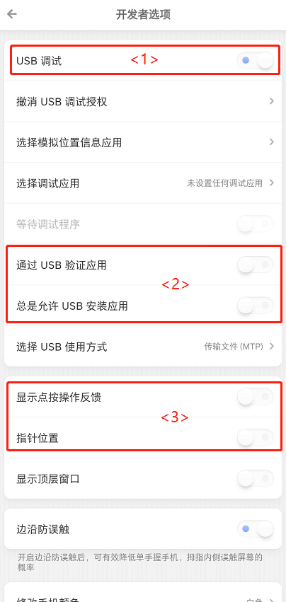
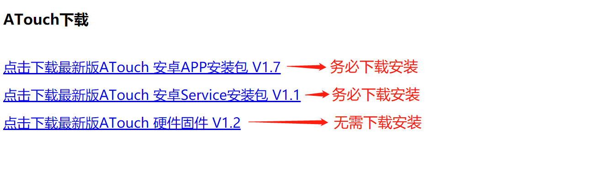
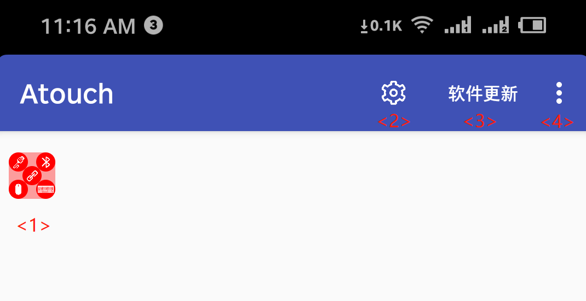
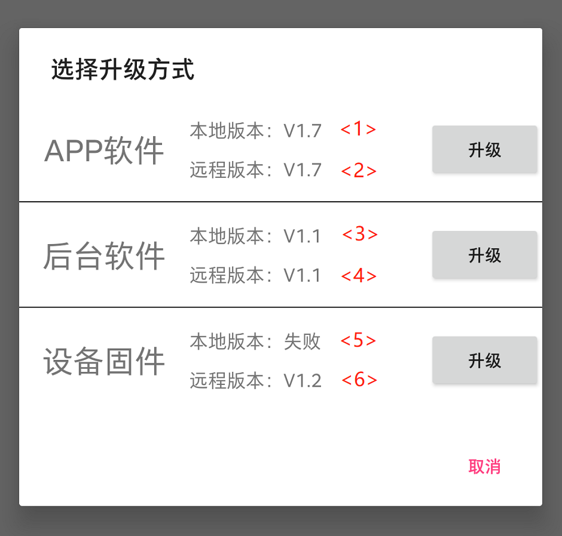
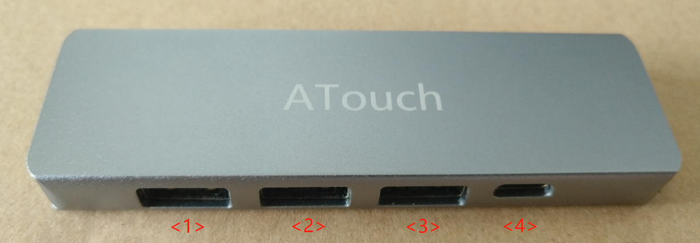
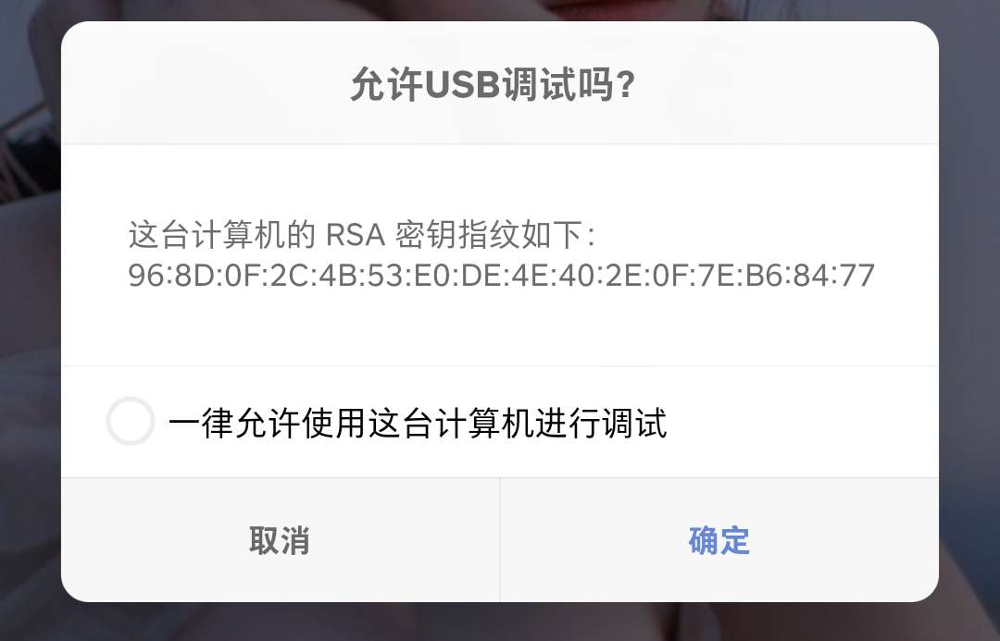
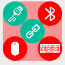
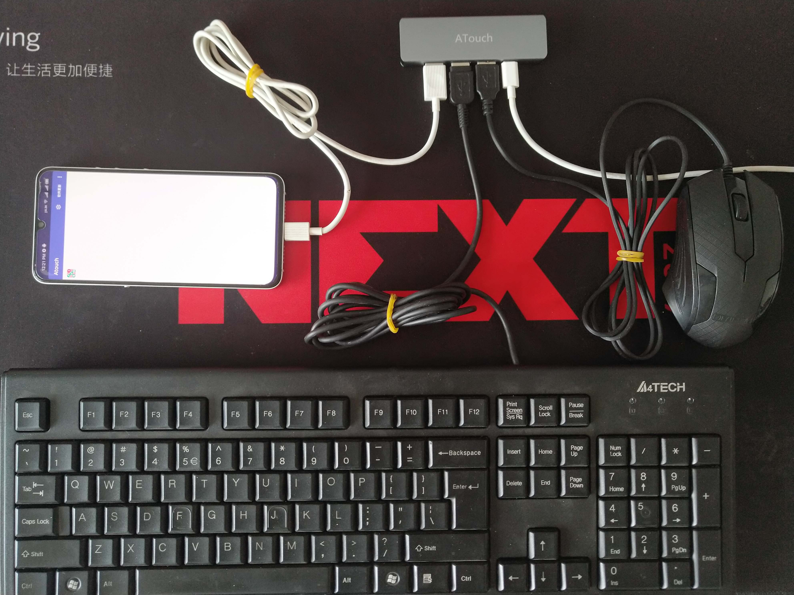

# ATouch 使用说明

* 为了使每一位小伙伴都能理解如何使用，请务必按顺序阅读。
* 本教程是使用ATouch外壳版，有线连接手机(电脑数据线插手机)的方式提供说明的。

## 1. 使用ATouch所需基本前提
### 1.1 ATouch硬件设备

 
* 手上没有的话，请先购买: [购买链接](https://item.taobao.com/item.htm?id=595635571591)    
* 旧版(无外壳版同样可以使用)  

### 1.2 Android手机
* Anroid手机支持支持主流大厂手机，Android版本5.0及以上提供支持，5.0以下不管。
* 由于目前测试机型较少，出现问题请及时反馈。  

### 1.3 至少两根数据线
* 数据线一根是连接ATouch和手机的，另一根给ATouch提供用电。

## 2. 打开Android手机的调试模式
* Android手机的调试模式是使ATouch与手机数据线连接进行ADB通讯的前提，所以务必打开。  
* 关于如何打开手机的调试模式，各厂家的操作入口可能都不同统一，下面提供一些常见厂商的手机调试模式打开方法的连接。  
 
[华为手机](https://jingyan.baidu.com/article/2a138328ec2c43074a134fb4.html)    
 
[小米手机](https://jingyan.baidu.com/article/af9f5a2d42a79143140a458d.html)    
 
[OPPO手机](https://jingyan.baidu.com/article/cb5d6105b0936a005d2fe052.html)    
 
[VIVO手机](https://jingyan.baidu.com/article/f54ae2fce2f0625e93b84959.html)    
 
[三星手机](https://jingyan.baidu.com/article/0aa223756d8aec88cc0d64ee.html)    
 
[一加手机](https://jingyan.baidu.com/article/67508eb47b824a9cca1ce48b.html)    
 
如果没有你的品牌手机打开调试模式方法链接提供，请自行[百度](https://www.baidu.com/s?wd=%E6%89%93%E5%BC%80%E8%B0%83%E8%AF%95%E6%A8%A1%E5%BC%8F)  
   

* 打开调试模式后如图所示  
   
   
   

| 序号 | 说明 |
|:-----:|:-----:|
| <1> | 务必打开USB调试  |
| <2> | 确保该处两项为关闭状态 |
| <3> | 在调试触摸位置的过程中，打开这个选项可以帮助调试 | 

* 有位红魔5G用户必须将"通过USB验证应用"关闭才可以使用，所以请确保将其关闭。

## 3. 手机安装所需软件
* [安装包下载链接](http://guanglundz.com/atouch/download.html) 
   
  

* 两个安装完成后你会发现手机出面出现了一个图标  
  
   
   

* 打开软件会看到如下界面
  

   
   

| 序号 | 说明 |
|:-----:|:-----:|
| <1> | 悬浮状态指示/操作控制窗口  |
| <2> | 设置按键 |
| <3> | 软件更新按键 |
| <4> | 更多选项 |

* 关于悬浮窗口的说明

   
   

| 序号 | 说明 |
|:-----:|:-----:|
| A | 手机APP与ATouch后台服务程序连接状态指示，连接成功将变成绿色 |
| B | 手机APP与ATouch开发板USB连接状态指示，连接成功将变成绿色 |
| C | 手机APP与ATouch开发板蓝牙连接状态指示，连接成功将变成绿色 |
| D | ATouch开发板与鼠标连接状态指示，连接成功将变成绿色 |
| E | ATouch开发板与键盘连接状态指示，连接成功将变成绿色 |

## 4. 查看安装软版本
* 点击APP界面上的"软件更新"按钮会弹出安装状态
  

   
   

| 序号 | 说明 |
|:-----:|:-----:|
| <1> | 当前安装的APP版本 |
| <2> | 远程可安装下载的APP版本，如果远程版本大于本地版本，则可以点击"升级"按键进行APP升级 |
| <3> | 当前安装的后台服务软件版本，如果没有安装会显示"失败"，请务必确保已安装后台服务 |
| <4> | 远程可安装下载的后台软件版本，如果远程版本大于本地版本，则可以点击"升级"按键进行后台软件升级 |
| <5> | ATouch的固件版本，此处一般为错误，因为还未实现-。- |
| <6> | ATouch的远程固件版本 |

* 确保 APP软件的本地版本不会出现"错误"，后台软件的本地版本不会出现"错误"，否则说明手机没有安装该软件。
   

## 5. 使用ATouch连接手机

   
   

| 序号 | 说明 |
|:-----:|:-----:|
| <1> | 手机、鼠标、键盘插口 |
| <2> | 手机、鼠标、键盘插口 |
| <3> | 手机、鼠标、键盘插口 |
| <4> | 供电、调试插口 |

* 首先给供电口<4>使用Typec数据线5V供电（使用手机充电器供电即可）
* <1>/<2>/<3>三个插口随便选择一个使用数据线插入手机。
* 如果是第一次插入，会弹出下面窗口，请选择"一律允许使用这台计算机进行调试"，然后点击确定。  
  
   
   

* 进行完以上步骤后，正常的话悬浮窗口的中间和左上角标识会亮起来。如果没有亮起，请返回检查上面的步骤是否有误。如果多次尝试以后仍出现问题，请将问题描述给我。  
  
   
   

## 5. 使用ATouch连接键盘鼠标

* 将键盘和鼠标插入剩下两个接口，如果正常的话悬浮窗会亮成如下状态。  
  
   
 

* 插线状态如下
  
   
   

## 6. 设计游戏映射