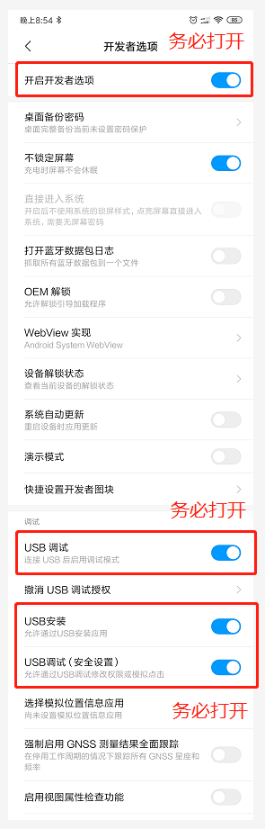

# ATouch 开源项目

## 下载资源
[手机APP](https://gitee.com/guanglunking/ATouch/releases)  
[WINDOWS客户端](https://gitee.com/guanglunking/ATouchClient/releases)  
[LINUX客户端【请自行编译】](https://gitee.com/guanglunking/ATouchClient)  
[ESP32客户端固件](https://gitee.com/guanglunking/ESP32_CH374U/releases)  
[Android后台固件](https://gitee.com/guanglunking/ATouchService/releases)  

## ATouch项目旧版简介

说起这个项目的起源，可能大概也许是源于自己用手搓手机菜的抠脚吧，也或许是因为对开发的热情大过于玩的热情哈哈，反正这个东西反反复复得折腾了半年之久了，对这个东西的定位也渐渐从做一个人人都能玩的商品到单纯做一个有吃鸡功能的开发板。现在把他开源出来，也算是回报互联网上良多开源的资料教程吧！  

吃鸡开发板目前使用ESP32+CH374U方案，为实现通过键鼠操作Android手机（模拟触屏），通过USB线与Android连接，使用ADB协议进行通讯控制。  

## ATouch项目新版简介

这个项目的出发点本来如上简介所说的为了做个开发板，结果一发不可收拾。本来不计划做WIN或者LINUX的支持的，结果为了把项目做完整做成熟索性WIN和LINUX平台都支持了，并且将ESP32的硬件平拍升级为嵌入式LINUX平台，支持更过的键鼠设备。（后期可能尝试支持IOS平台，目前暂无精力）   
  
祝大家玩的愉快^^

## 功能及研发进度
| 功能 | 进度 |
|:-----:|:-----:|
| ESP32硬件 | 已完成 |
| 键鼠USB连接 | 已完成 |
| ADB连接 | 已完成 |
| WIFI连接 | 已完成 |
| WIFI固件升级 | 已完成 |
| 手机OTG串口连接 | 已完成 |
| 扩展坞投屏串口连接 | 已完成 |
| WIN客户端 | 初版发布 |
| LINUX客户端 | 初版发布 |
| 体感模拟 | 正在研发(可能流产) |
| LINUX嵌入式硬件 | 正在研发 |
| 手柄连接 | 计划研发 |  

   
## 源码和资料

[ATouch安卓APP源码](https://gitee.com/guanglunking/ATouch)【开发环境：AndroidStudio】  

[ATouch WIN&LINUX客户端源码（支持嵌入式LINUX）](https://gitee.com/guanglunking/ATouchClient)【开发环境：gcc or MinGW】  

[ATouch板子源码](https://gitee.com/guanglunking/ESP32_CH374U) 【开发环境：Linux SDK:ESP-DIF3.2】  

[ATouch安卓后台程序源码](https://gitee.com/guanglunking/ATouchService)【开发环境：android-ndk-r13b】  

[淘宝店铺](https://item.taobao.com/item.htm?id=595635571591)  

[演示视频](https://www.bilibili.com/video/av53687214)  

#### 键鼠操作
<iframe height="480" width="100%" src="//player.bilibili.com/player.html?aid=53687214&cid=93910781&page=1" scrolling="no" border="0" frameborder="no" framespacing="0" allowfullscreen="true"> </iframe>  
   

#### ATouch通过wifi连接手机 手机typec转HDMI投屏  

<iframe height="480" width="100%" src="//player.bilibili.com/player.html?aid=412674734&bvid=BV1JV411o7QV&cid=174816385&page=1" scrolling="no" border="0" frameborder="no" framespacing="0" allowfullscreen="true"> </iframe>

   

## 开发板升级

#### 1.开发板进入升级模式  
如下图，开发板通电后按住左键不放按右键重启板子，此时板子会进入升级模式。
   
  
   

#### 2.手机连接WIFI  
手机连接WIFI热点"upgrade",密码123456789

#### 3.手机APP升级
打开手机APP，点击升级设备，选择本地文件升级
   
  
   

选择手机根目录下的/ATouch/ATouch.bin文件升级
   
  
   

升级完成后会提示成功，至此板子固件更新完成

## APP使用

### 1.安装
手机安装ATouch APP，并将手机的开发者模式（必须）打开。不同机型打开方式可能各有差异，详情百度。  
ATouch软件需要悬浮窗口的权限，如果开启软件后申请失败请再次打开尝试。

   
  
   

### 2.连接
软件打开后会出现悬浮窗口，悬浮窗口所表示的状态如下表格所示。手机APP打开后，ATouch开发板插上电源，并将开发板与手机通过USB连接（此时必须已经打开开发者模式），如果是第一次插入会弹出窗口询问是否加入秘钥，点击确定后B和A将会变成绿色（连接成功），如果此时为变绿说明连接失败，应检查开发板和APP的连接与开发者模式是否开启。
   
  
  
   

| 功能 | 进度 |
|:-----:|:-----:|
| A | 手机APP与ATouch后台服务程序连接状态指示，连接成功将变成绿色 |
| B | 手机APP与ATouch开发板USB连接状态指示，连接成功将变成绿色 |
| C | 手机APP与ATouch开发板蓝牙连接状态指示，连接成功将变成绿色 |
| D | ATouch开发板与鼠标连接状态指示，连接成功将变成绿色 |
| E | ATouch开发板与键盘连接状态指示，连接成功将变成绿色 |

### 3.设置
打开吃鸡软件进入按键设置界面
   
  
   

| 功能 | 进度 |
|:-----:|:-----:|
| A | 设置（未开发） |
| B | 映射库操作，可以对映射进行新建删除修改操作 |
| C | 对映射进行编辑，使其适应自己的手机 |
| D | 保存数据库 |

新建映射库并编辑保存，务必将映射库的单元拖动到正确的触摸位置，否则无法使用正常功能！
   
  
   
 
   

## APP升级

目前仅支持手动下载固件安装

## 获取开发板日志
使用USB线连接板子至电脑，如下两个usb都可以连接。下载CP2102驱动并安装  
* [驱动地址](https://www.silabs.com/products/development-tools/software/usb-to-uart-bridge-vcp-drivers)
* [串口调试助手](http://www.pc6.com/softview/SoftView_624283.html)

   
  
   

使用串口助手，波特率115200。打开后发送"olog"(注意取消发送回车行)
   
  
   

正常的话接收窗口会接收到LOG，可将LOG保存为文件发送给我调试
   
  
   

## ESP32版 硬件说明

### ESP32版接口说明

  

| 编号 | 说明 |
|:-----:|:-----:|
| A | MicroUSB端口，5V供电或串口调试（A与B只使用其一） |
| B | TypeC端口，5V供电或串口调试（A与B只使用其一） |
| C | USB1端口，插入键盘、鼠标或者手机 |
| D | USB2端口，插入键盘、鼠标或者手机 |
| E | USB3端口，插入键盘、鼠标或者手机 |
| F | 功能按键 |
| G | 功能按键，GPIO0 |
| H | 复位按键 |  

   

### 串口指令（波特率115200 不加回车换行符）

| 命令 | 效果 | 说明 |
|:-----:|:-----:|:-----:|
| open | 打开串口传输模式 | 将会只传输状态和键鼠信息（关闭log） |
| close | 关闭串口传输模式 | 停止传输状态和键鼠信息 |
| slogn | 设置LOG级别 NONE | 停止输出任何LOG |
| sloge | 设置LOG级别 ERROR | 只输出 ERROR LOG |
| slogw | 设置LOG级别 WARN | 输出 WARN 及以上 LOG |
| slogi | 设置LOG级别 INFO | 输出 INFO 及以上 LOG |
| slogd | 设置LOG级别 DEBUG | 输出 DEBUG 及以上 LOG |
| slogv | 设置LOG级别 VERBOSE |  输出所有LOG |

 

* 上电默认LOG模式：INFO （slogi）  

 
 

## 按键映射 操作说明

| 按键 | 效果 |
|:-----:|:-----:|
| 鼠标左键 | 射击（攻击）或触摸指针位置（唤醒鼠标指针的模式下） |
| 鼠标中键 | 唤醒鼠标指针 和 隐藏鼠标指针切换 |
| 鼠标右键 | 打开瞄准镜 |
| W | 前进（W+Shift为加速向前跑） |
| S | 后退 |
| A | 左走 |
| D | 右走 |
| Ctrl(左) | 趴下 |
| Alt(左) | 蹲下 |
| 空格 | 跳跃 |
| Z | 开车 |
| X | 上副驾驶 |
| C | 下车 |
| Q | 左武器切换 |
| E | 右武器切换 |
| R | 换弹药 |
| M | 地图显示、关闭 |
| B | 背包显示、关闭 |
| F | 环视（身体及行动的方向不变看四周情况） |
| G | 用药 |
| H | 救援 |

 

