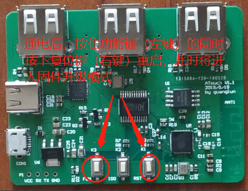
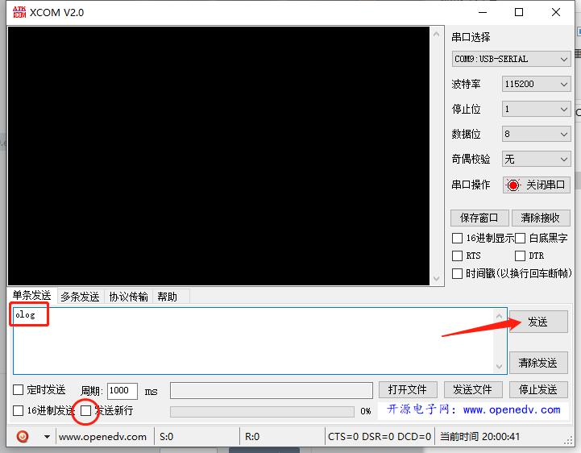

# 吃鸡开发板 升级方法

## 开发板升级

#### 1.开发板进入升级模式  
如下图，开发板通电后按住左键不放按右键重启板子，此时板子会进入升级模式。
   
  
   

#### 2.手机连接WIFI  
手机连接WIFI热点"upgrade",密码123456789

#### 3.手机APP升级
打开手机APP，点击升级设备，选择本地文件升级
   
  
   

选择手机根目录下的/ATouch/ATouch.bin文件升级
   
  
   

升级完成后会提示成功，至此板子固件更新完成

## APP升级

目前仅支持手动下载固件安装

## 获取开发板日志
使用USB线连接板子至电脑，如下两个usb都可以连接。下载CP2102驱动并安装  
* [驱动地址](https://www.silabs.com/products/development-tools/software/usb-to-uart-bridge-vcp-drivers)
* [串口调试助手](http://www.pc6.com/softview/SoftView_624283.html)

   
  
   

使用串口助手，波特率115200。打开后发送"olog"(注意取消发送回车行)
   
  
   

正常的话接收窗口会接收到LOG，可将LOG保存为文件发送给我调试
   
  
   