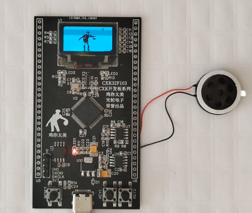

# CXK开发板

## 简介

CXK开发板就是一款基于STM32F103 MCU的开发板。

## 源码和资料

[开发板音视频播放源码](https://gitee.com/guanglunking/cxkboard)【开发环境：Vscode PIO】  

[PC上位机](https://gitee.com/guanglunking/gldzpc)【开发环境：QT5.6.0 qt-opensource-windows-x86-mingw492-5.6.0】  

[淘宝店铺](https://item.taobao.com/item.htm?ft=t&id=629250846356)  

## 配置 

| 项目 | 说明 |
|:-----:|:-----:|
| STM32F103RCT6 | ST MCU |
| W25Q32 | 4MB Flash |
| CH340N | 串口调试通讯 |
| NS8002 | 音频功率放大器 |
| OLED | 128*64 |

## 说明
* 音视频都未经压缩，目前视频是20帧每秒，音频是8KHz的采样，音频播放底噪比较大，效果不是太好。  

* 上位机使用ffmpeg对输入的视频（理论上各种格式都可以）进行处理，最终生成一个.gl文件（我自定义的格式），将之通过串口烧写到板载的W25Q32 Flash上，目前使用的Flash比较小，所以限制了生成文件的大小，最大生成1min30s时长的烧写文件。  

## 图片及演示视频

  
   

  
   

[演示视频 Bad Apple](https://www.bilibili.com/video/BV1vy4y1C7RY)    
<iframe height="480" width="100%" src="//player.bilibili.com/player.html?aid=797410897&bvid=BV1vy4y1C7RY&cid=243857484&page=1" scrolling="no" border="0" frameborder="no" framespacing="0" allowfullscreen="true"> </iframe>  
   

[演示视频 鸡你太美](https://www.bilibili.com/video/BV1F54y1C7SJ)    
<iframe height="480" width="100%" src="//player.bilibili.com/player.html?aid=842408728&bvid=BV1F54y1C7SJ&cid=243858444&page=1" scrolling="no" border="0" frameborder="no" framespacing="0" allowfullscreen="true"> </iframe>  
   

