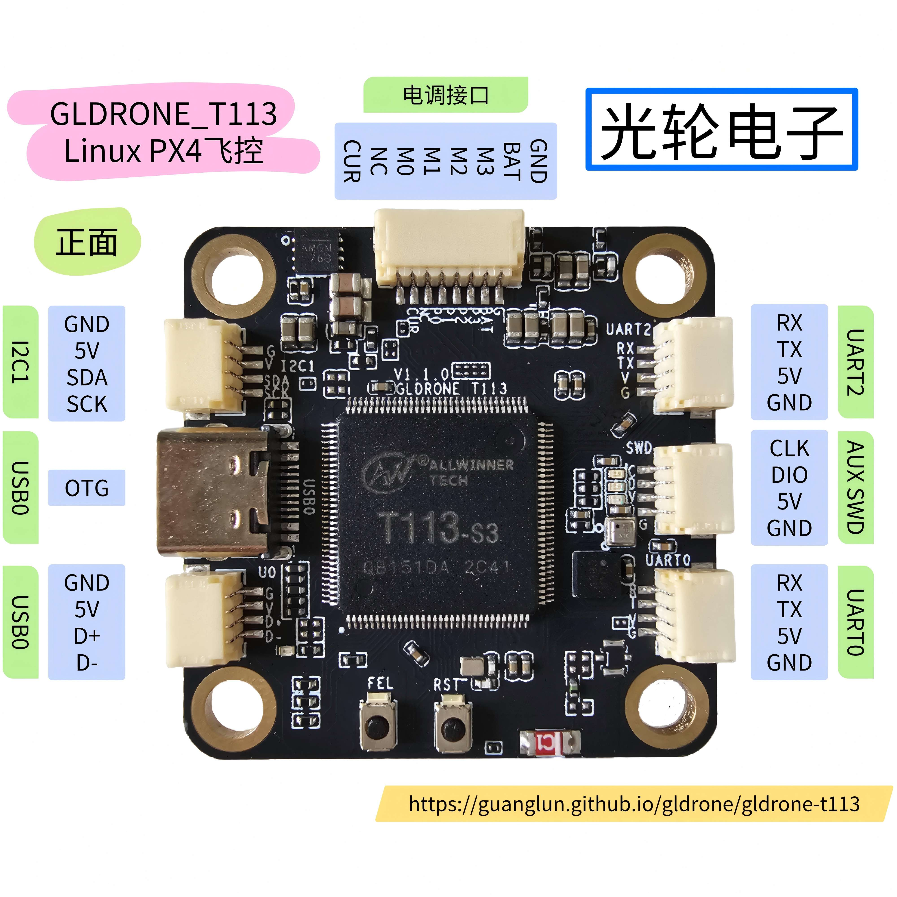
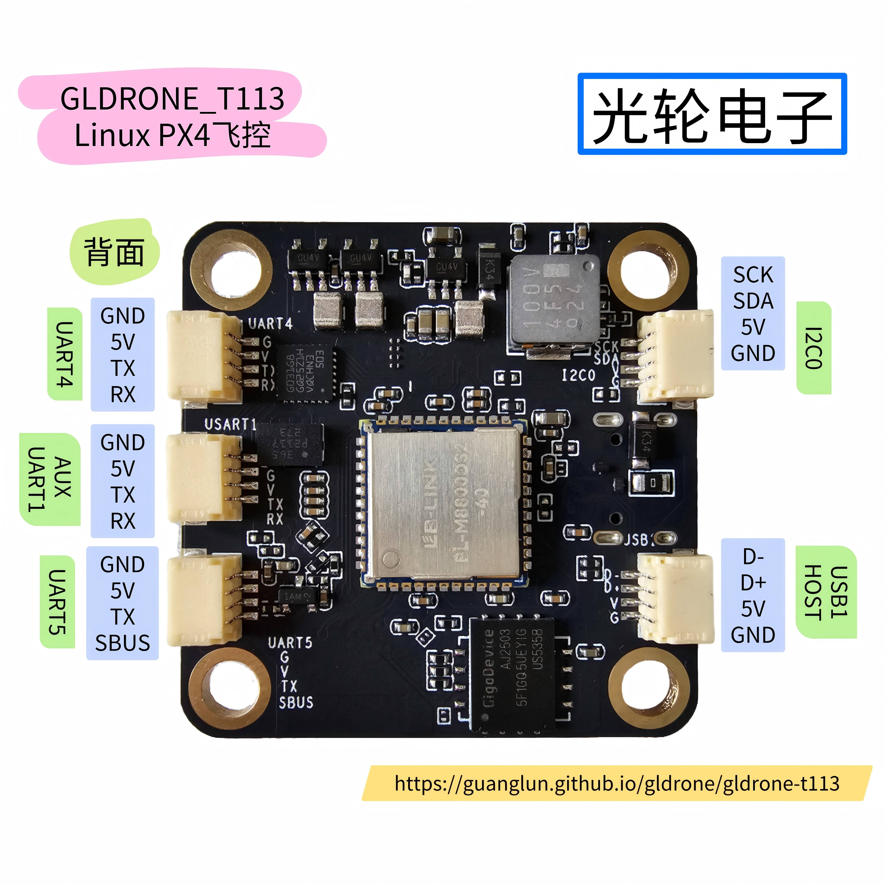
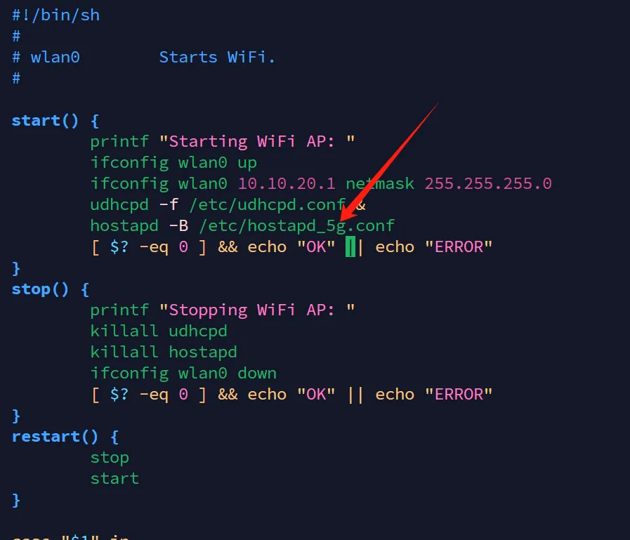
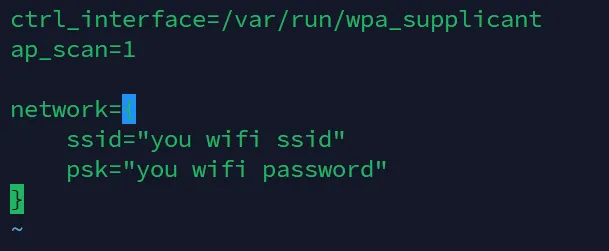
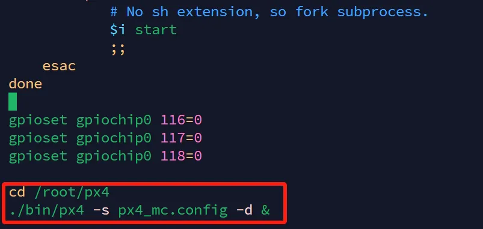
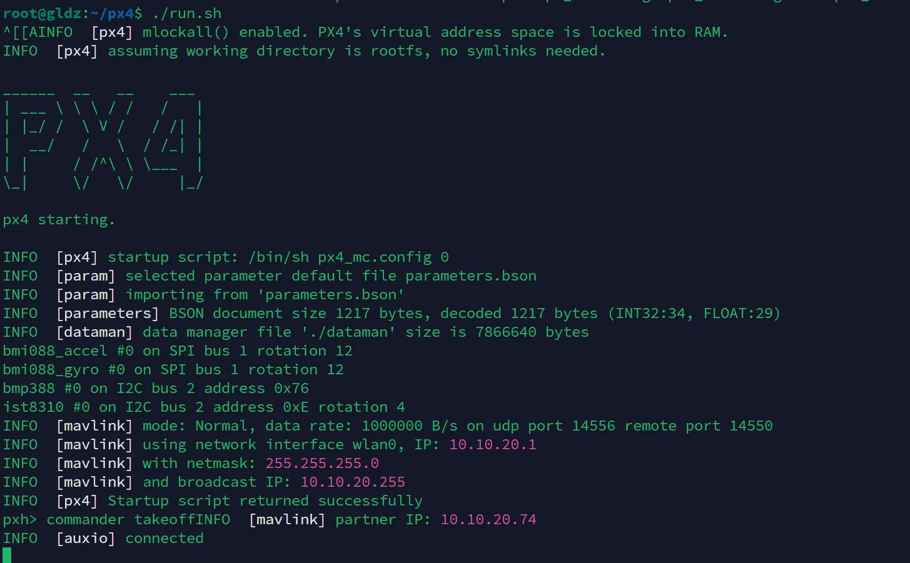

# GLDRONE-T113

!!! warning
    本飞控是实验性质飞控，非传统基于STM32的PX4飞控，在使用过程中可能会发生任何不可预料问题，请谨慎操作！敏感操作一定要拆桨操作！  
    请不要装到大轴距四轴进行测试，请装在150mm左右轴距机架室内飞行使用！大轴距四轴出意外伤害太大，请牢记本飞控仅为实验性质飞控！  
    非PX4老手不建议使用，为了您的安全！   

## 简介
  Linux飞控我已经做了好几年，之前做过一款R329的Linux飞控本打算量产，却因为飞行效果不甚理想就搁置了。现在使用全志T113-S3的这款飞控经历了许久的研发测试最终效果还算不错，批量出来提供给PX4爱好者研究使用，希望大家玩的愉快（使用一定要注意安全！）  

* 本飞控软件都开源，硬件原理图开源，PCB不开源  
* 购买连接：[淘宝](https://item.taobao.com/item.htm?id=914148984486)  
* 原理图PDF：[原理图](https://github.com/guanglun/gldrone_t113/blob/main/GLDRONE_T113_V110-20250328.pdf)  
* GLDRONE开源机架设计文件：[机架](https://github.com/guanglun/gldrone_t113/tree/main/GLDRONE%E6%9C%BA%E6%9E%B6V1.0)  
  
  
!!! warning
    8Pin接口与电调板对接时务必确认接线没有接反！接反的话会直接烧毁飞控！
    
## 方案说明   
| 类别 | 方案 | 说明 |
|:-----:|:-----:|:-----:|
| 主控芯片 | 全志T113-S3 | 双核A7 内置128MB DDR3 在Linux中运行PX4程序 |
| 辅助芯片 | STM32G031 | 辅助输出dshot300，ADC读取电池电压电流，串口连接T113 |
| IMU | BMI088 | 使用SPI连接T113 |
| 磁罗盘 | IST8310 | 使用I2C连接T113 |
| 气压计 | BMP388 | 使用I2C连接T113 |
| WIFI模块 | AIC8800-D4模块 |2.4G 5G双频WIFI（硬件支持蓝牙功能，当前软件未调试完善）|
| USB | 1*OTG 1*HOST | USB2.0 480MHz |
| 串口 | 5个串口 | T113引出4个串口（SBUS需要占用一个）G0引出一个串口 |
| I2C | 2*I2C | T113引出两个I2C |
| SWD | 1*SWD | AUX G0引出SWD接口 |
| 电调接口 | 电调接口 | 8Pin sh-1.0 |  

* 4Pin接口都使用SH1.0
* 板子孔距30.5*30.5

## 软件说明  
| 类别 | 方案 | 说明 |
|:-----:|:-----:|:-----:|
| Linux系统版本 | v6.8 | 主线内核，未加RT补丁 |  
| PX4版本 | v1.14.2 | 基于该版本添加Linux飞控支持 |  

* Linux用户名：root  密码：root  
* 串口4为Linux调试串口，波特率115200  
* WIFI热点名：DRONE5G 密码：12345678  

## 开源地址  
| 类别 | 地址 | 分支 | 说明 |
|:-----:|:-----:|:-----:|:-----:|
| buildroot | [https://github.com/guanglun/buildroot-t113](https://github.com/guanglun/buildroot-t113) | gldrone_t113 | 编译文件系统和Linux内核 |
| awboot | [https://github.com/guanglun/awboot](https://github.com/guanglun/awboot) | gldrone_t113 | 负责内核启动 |  
| PX4 | [https://github.com/guanglun/PX4-Autopilot](https://github.com/guanglun/PX4-Autopilot) | GLPX4_T113_V1.14.2 | PX4程序 |  
| AUX G0 | [https://github.com/guanglun/stm32g0_dshot](https://github.com/guanglun/stm32g0_dshot) | px4 | AUX G0 程序 |  

## 到手使用  
1. 板子到手后请插入typec线缆上电，等待片刻后使用电脑连接飞控板的热点WIFI：`DRONE5G`(密码：`12345678`)(使用5G频段是为了避免2.4G遥控器干扰，可以手动进入系统切换2.4G)  
2. 连接上飞控的热点后打开QGC地面站（最新版即可），工作正常的话会发现地面站已经和飞控连接
3. 将飞行器拆桨，装上飞控。配置遥控器的话可以使用typec供电，检查电机方向和顺序的话需要连接3s电池（目前仅测试可3s，4s应该也是支持的）  
4. 连接上接收机，在遥控器配置界面校准遥控器并设置飞行模式  
5. 检查电机顺序和方向，当前仅支持PX4的X机架，其他没测试。电调请使用支持`dshot300`的电调，电机方向反向的话请交换线序，软件不支持反向电机  
6. 可以校准一下陀螺仪和水平  
7. 在未装桨情况下解锁测试功能是否正常  
8. 装桨小心测试飞行  

<iframe height="480" width="100%" src="//player.bilibili.com/player.html?isOutside=true&aid=114365298642909&bvid=BV1rT54zYE2P&cid=29505880752&p=1" scrolling="no" border="0" frameborder="no" framespacing="0" allowfullscreen="true"> </iframe>  

## 配置说明  
### 使用热点  
进入终端配置脚本  
```  
rm /etc/init.d/S45*
cp /etc/S45wifi_ap /etc/init.d/
```  

### 热点2.4G/5G切换  
进入终端修改脚本vim /etc/init.d/S45wifi_ap  
  
"hostapd"后面添加"_5g"为使用5G热点，不添加为使用2.4G热点  

### WIFI连接路由器使用  
进入终端配置脚本  
```  
rm /etc/init.d/S45*
cp /etc/S45wifi_client /etc/init.d/
```  
vim修改/etc/wpa_supplicant.conf文件  
  
将ssid和psk后引号内修改成用户路由器热点信息  
修改完成后reboot重启即可。IP可以通过串口或者路由器查看  

### 打开/关闭PX4程序开机运行  
进入终端修改脚本vim /etc/init.d/rcS    
  
将文件末尾两行打开/关闭注释，然后重启即可  
px4的可执行文件和配置文件都在/root/px4目录下，可手动使用run.sh脚本启动程序  
  

## 编译  
### awboot编译  
```
git clone https://github.com/guanglun/awboot.git -b gldrone_t113
cd awboot 
make spi-boot.img
```
### buildroot编译  
```
git clone https://github.com/guanglun/buildroot-t113.git -b gldrone_t113
cd buildroot-t113 
make gldz_t113_defconfig
make 
```
### px4编译  
```
git clone https://github.com/guanglun/PX4-Autopilot.git --recursive -b GLPX4_T113_V1.14.2
cd PX4-Autopilot
make px4_t113_default
```
### px4程序上传飞控
修改`PX4-Autopilot/boards/px4/t113/cmake/upload.cmake`文件中的此行：`set(AUTOPILOT_HOST "10.10.20.1")`的IP地址（飞控的IP），然后执行：  
```
make px4_t113_default upload
```  
即可将编译好的飞控可执行文件和配置上传至飞控  

## 烧写  
### 准备
完整烧写需要编译出以下文件：  

| 类别 | 源自 | 烧写地址 | 文件名 | 说明 |  
|:-----:|:-----:|:-----:|:-----:|:-----:|  
| awboot | awboot | 0x0000000 | awboot-boot-spi.bin | boot程序 |  
| dtb | buildroot | 0x40000 | sun8i-gldz-t113.dtb | 设备树文件 |  
| zImage | buildroot | 0x80000 | zImage | Linux内核 |  
| rootfs | buildroot | 0x800000 | rootfs.ubi | 文件系统 |  
  
上面文件所在编译源码后路径： 

| 类别 | 路径 |  
|:-----:|:-----:|  
| awboot | awboot/awboot-boot-spi.bin |  
| dtb | buildroot-t113/output/images/sun8i-gldz-t113.dtb |  
| zImage | buildroot-t113/output/images/zImage |  
| rootfs | buildroot-t113/output/images/rootfs.ubi |  

### 开烧
烧写使用`xfel`：[https://github.com/xboot/xfel.git](https://github.com/xboot/xfel.git)  
`xfel`支持`linux`和`windows`，推荐使用linux系统（windows的驱动安装比较麻烦）  
!!! warning
    烧写请一定拆桨！请仅使用typec供电！  
两种方式进入`下载模式`（选择一种即可）：  

* 飞控接typec上电，按住fel按键不松手，然后按一下rst按键，然后可以松开fel按键  
* 按住fel按键不松手，飞控接typec上电，然后可以松开fel按键  

进入`下载模式`后,可以使用下面命令检测设备是否进入下载模式且连接成功：  

* 输入`lsusb`，返回内容中有一行: `Bus 001 Device 002: ID 1f3a:efe8 Allwinner Technology sunxi SoC OTG connector in FEL/flashing mode`  

* 输入`sudo xfel spinand`,返回：`Found spi nand flash 'GD5F1GQ5UExxG' with 134217728 bytes`  

如果上面两个命令执行成功，接下来按照下面命令进行烧写即可：  
```  
sudo xfel spinand erase 0 0x8000000
sudo xfel spinand write 0 awboot-boot-spi.bin
sudo xfel spinand write 0x40000 sun8i-gldz-t113.dtb
sudo xfel spinand write 0x80000 zImage
sudo xfel spinand erase 0x800000 0x7800000
sudo xfel spinand write 0x800000 rootfs.ubi
```  


## 演示视频  
<iframe height="480" width="100%" src="//player.bilibili.com/player.html?isOutside=true&aid=113855522932961&bvid=BV1MWwCePEAb&cid=27962509842&p=1" scrolling="no" border="0" frameborder="no" framespacing="0" allowfullscreen="true"> </iframe>  
<iframe height="480" width="100%" src="//player.bilibili.com/player.html?isOutside=true&aid=114330267945360&bvid=BV1k6d6YPEs6&cid=29391261176&p=1" scrolling="no" border="0" frameborder="no" framespacing="0" allowfullscreen="true"> </iframe>  
<iframe height="480" width="100%" src="//player.bilibili.com/player.html?isOutside=true&aid=114342330631917&bvid=BV1hjdfYaEFK&cid=29433069836&p=1" scrolling="no" border="0" frameborder="no" framespacing="0" allowfullscreen="true"> </iframe>  
<iframe height="480" width="100%" src="//player.bilibili.com/player.html?isOutside=true&aid=114347867179155&bvid=BV1AKoTYGELp&cid=29450636550&p=1" scrolling="no" border="0" frameborder="no" framespacing="0" allowfullscreen="true"> </iframe> 
