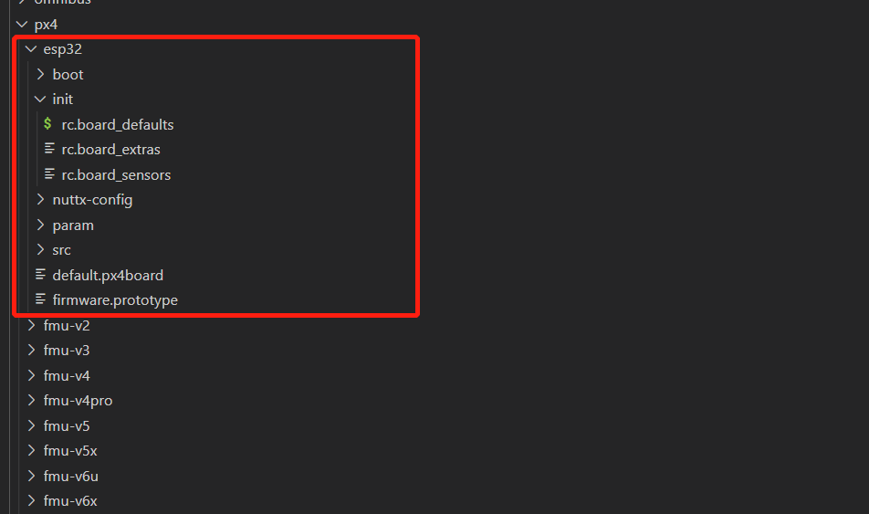
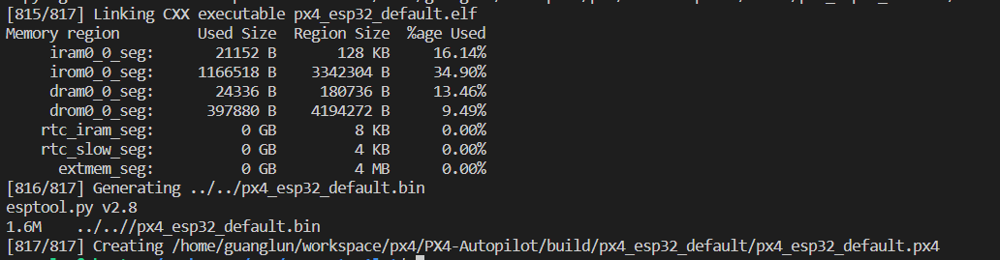
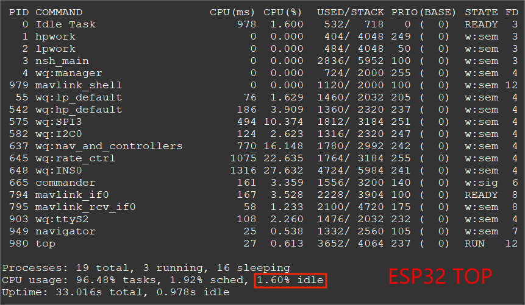
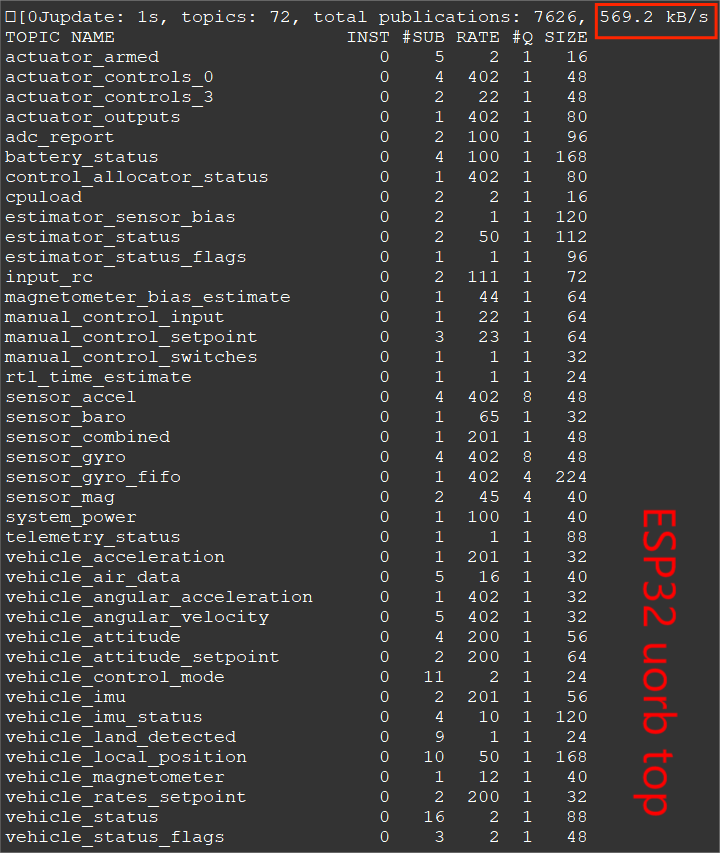
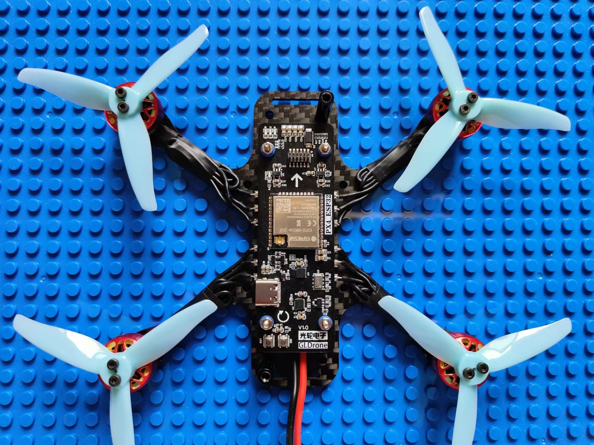
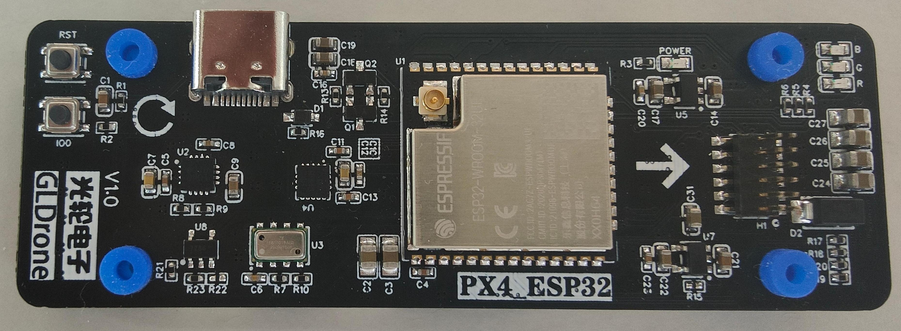
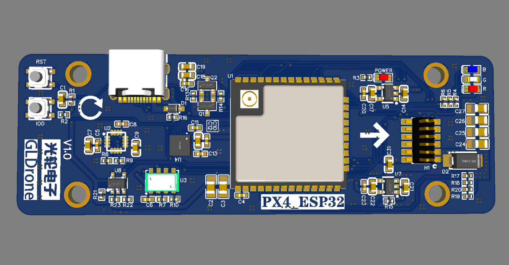
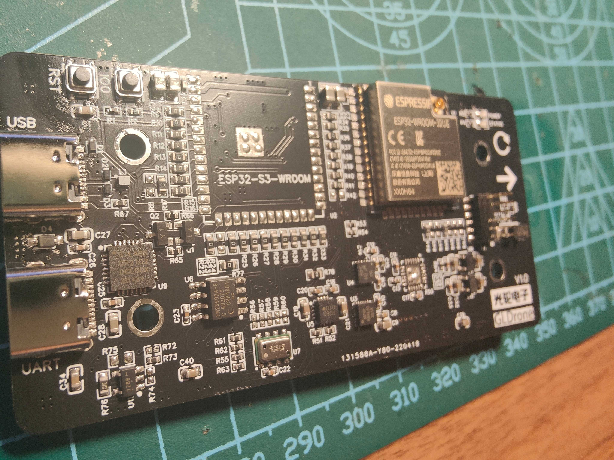
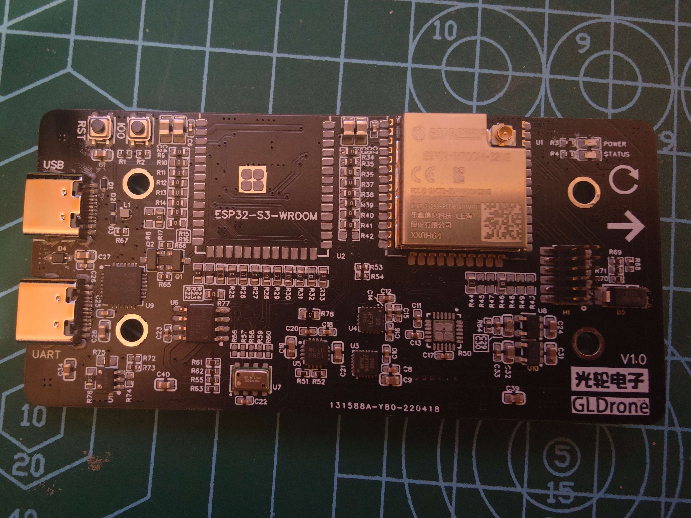

# GLPX4-ESP32

## 简介
将PX4移植到ESP32上是我一直有的一个想法，在得知NuttX已经支持ESP32以后我也开启了移植PX4的项目。历经了几个月的痛苦折磨终于在单核上成功运行并可以稳定飞行。虽有诸多不足，但也算是对自己一直有的这个想法的一个交待了。

!!! warning
    现在仅将ESP32单核移植并试飞成功，双核经过尝试后有诸多问题，仍未解决。  
    请确保使用小轴距四轴进行测试。由于单核负载已达98%，且有诸多位置问题无法解决，所以确保安全不要在大轴距飞行器上使用。  
    现在使用的是ESP32模块的FLASH机型参数保存，经测试有一定概率丢失配置。  

## 配置
* 主控: ESP32
* IMU： ICM-20602
* 磁力计：IST8310
* 气压计：MS5611


## 源码和资料
[支持ESP32的PX4源码](https://github.com/guanglun/PX4-Autopilot)  【请使用single_core_esp32分支】  
[PCB和原理图](https://oshwhub.com/guanglun/gldrone_esp32)  【立创EDA】  
开源的小机架以及电调请移步[开源四旋翼飞行器GLDrone](gldrone.md#gldrone)  
[QGC可参考的配置文件](https://github.com/guanglun/PX4-Autopilot/blob/single_core_esp32/boards/px4/esp32/param/esp32_fly.params)

* NuttX源码经测试VPU的现场保存及恢复存在问题，所以进行了一些浮点运算现场的保存。
* 在PX4的架构下成功添加了ESP32.  
   
## 编译

!!! note
    请首先学习掌握PX4源码编译的方法！更多可阅读PX4文档[https://docs.px4.io/master/en/dev_setup/building_px4.html](https://docs.px4.io/master/en/dev_setup/building_px4.html)

* 首先请安装`xtensa-esp-elf`编译器[xtensa-esp-elf](https://github.com/espressif/binutils-gdb/releases/download/esp-gdb-v11.1_20220318/xtensa-esp-elf-gdb-11.1_20220318-x86_64-linux-gnu.tar.gz)   

* 下载源码  
```
git clone https://github.com/guanglun/PX4-Autopilot.git --recursive -b single_core_esp32
```

* 编译
```
make px4_esp32_default
```
编译成功如下：  
   

* 烧写bootloader及固件(第一次烧写使用)
```
./Tools/flash_esp32.sh -f true
```

* 仅烧写固件
```
./Tools/flash_esp32.sh
```

## 示例
run `top` cmd:  
   

run `uorb top` cmd:  
   

 
 
 
  
  