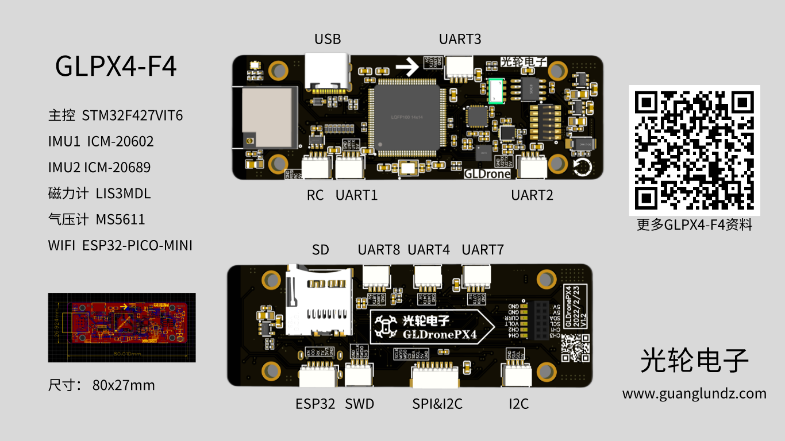
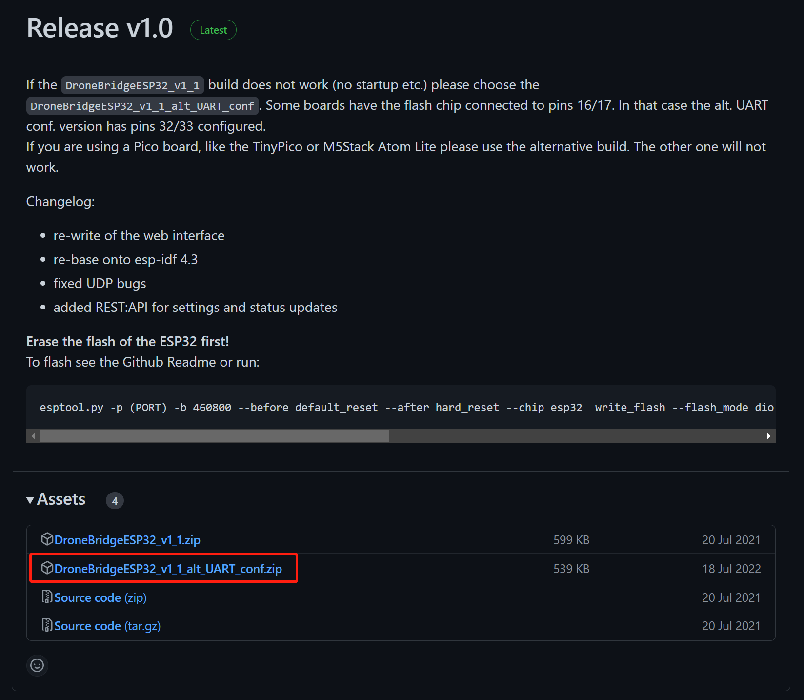
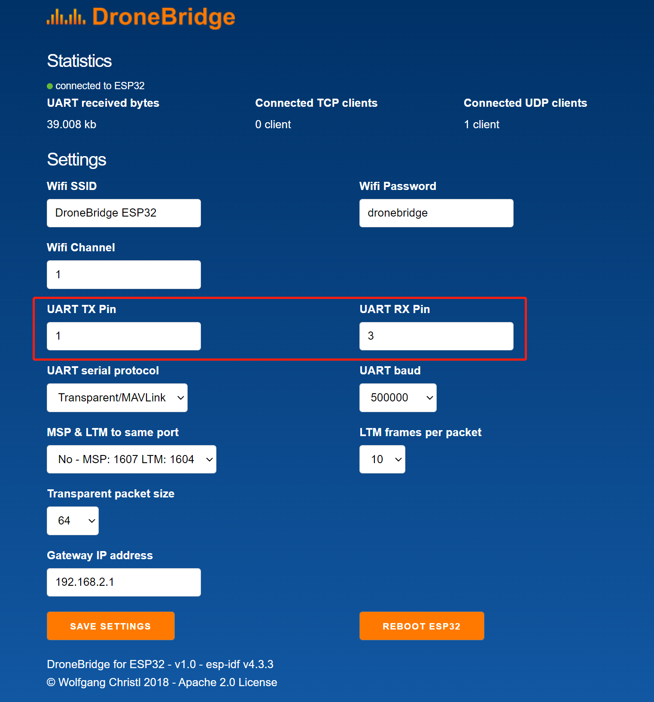
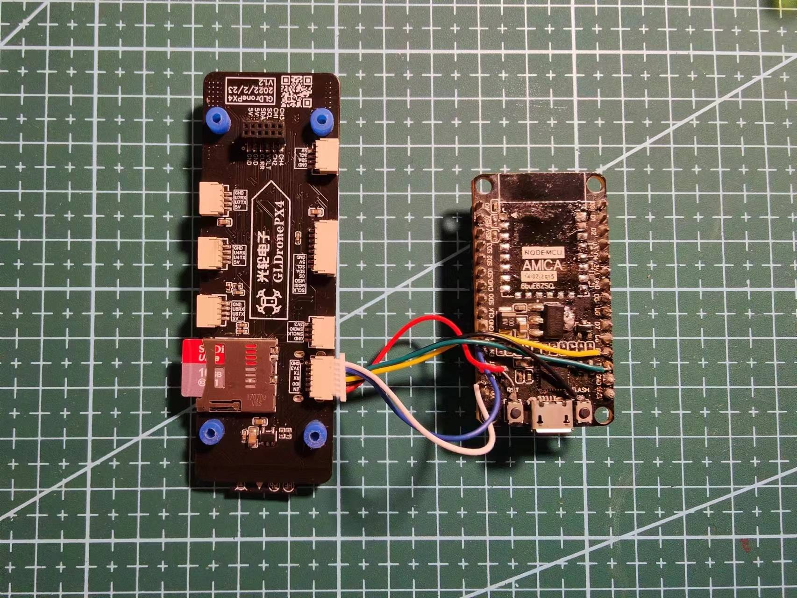
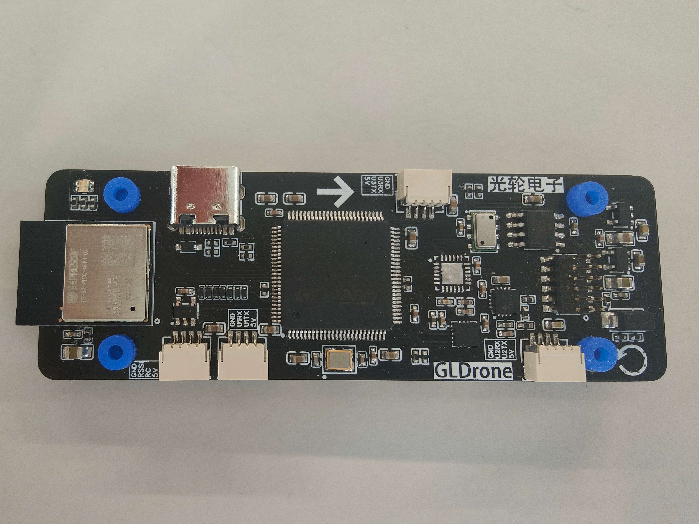
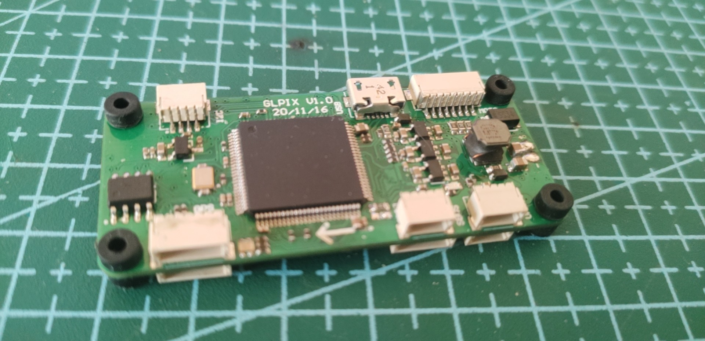

# GLPX4-F4
## 方案说明  
| 类别 | 方案 |
|:-----:|:-----:|
| 主控 | STM32F427VIT6 |
| IMU | ICM-20602 ICM-20602 |
| 磁力计 | LIS3MDL |
| 气压计 | MS5611 |
| WIFI | ESP32-PICO-MINI |
| 光流(可选模块) | PMW3901MB |
| 激光(可选模块) | VL53L1X |  

[GLPX4-F4原理图PCB开源地址](https://oshwhub.com/guanglun/gldrone_px4)  
[BLHeli电调原理图PCB开源地址](https://oshwhub.com/guanglun/gldrone_blheli_esc)  

硬件设计参考[pixracer](https://docs.px4.io/main/en/flight_controller/pixracer.html)方案，可以直接使用[PX4官方源码](https://github.com/PX4/PX4-Autopilot)编译：
```
make px4_fmu-v4_default
```
但是有些地方为了兼容我的修改设计进行了部分代码修改，所以推荐使用我修改后的代码编译固件：  
[修改后的源码地址](https://github.com/guanglun/PX4-Autopilot)(使用`GLPX4_F4`分支)  
同样是  
```
make px4_fmu-v4_default
```
提供已经变好的固件(仅供参考！)：  
[PX4格式](https://github.com/guanglun/guanglun.github.io/blob/master/docs/gldrone/file/px4_fmu-v4_default.px4)  
[BIN格式](https://github.com/guanglun/guanglun.github.io/blob/master/docs/gldrone/file/px4_fmu-v4_default.bin)  
配置文件(仅供参考！)：  
[params](https://github.com/guanglun/guanglun.github.io/blob/master/docs/gldrone/file/px4-f4-2022-10-3.params)  

Bootloader请自行编译，参考地址：  
[https://docs.px4.io/main/zh/software_update/stm32_bootloader.html](https://docs.px4.io/main/zh/software_update/stm32_bootloader.html)  
[https://github.com/PX4/PX4-Bootloader](https://github.com/PX4/PX4-Bootloader)  

## 接口说明  
   

## ESP32 WIFI方案 
参考链接：[https://docs.px4.io/main/en/telemetry/esp32_wifi_module.html](https://docs.px4.io/main/en/telemetry/esp32_wifi_module.html)  
固件地址：[https://github.com/DroneBridge/ESP32/releases](https://github.com/DroneBridge/ESP32/releases)  

* 由于使用的是`ESP32-PICO-MINI-02`模块，烧写固件请选择`UART`版本固件`DroneBridgeESP32_v1_1_alt_UART_conf`  

  

* 修改固件IO为TX:1 RX:3,其余项目请自行配置  
  

* 烧写请自制下载器直接从ESP32烧写接口进行烧写    
  

* new:
  
<br />

* 远古版本:  
  
<br />  
* 远古版本光流试飞视频:  
<iframe height="480" width="100%" src="//player.bilibili.com/player.html?aid=420006883&bvid=BV1d3411q7Dd&cid=394311072&page=1" scrolling="no" border="0" frameborder="no" framespacing="0" allowfullscreen="true"> </iframe>  