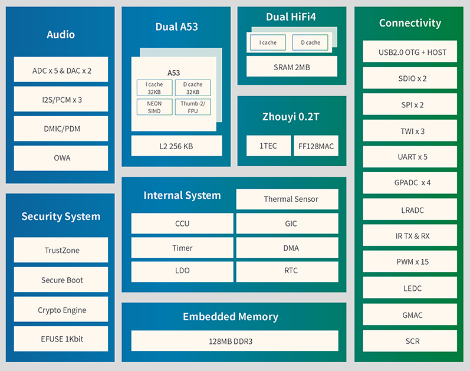

# GLPX4-R329

## 方案说明  
| 类别 | 方案 |
|:-----:|:-----:|
| 主控 | 全志R329 |
| IMU | ICM-20689 ICM-20602 |
| 磁力计 | IST8310 |
| 气压计 | MS5611 |
| WIFI | RTL8723DS |
| 光流(可选模块) | PMW3901MB |
| 激光(可选模块) | VL53L1X |  
    
  
   

[GLPX4-R329原理图PCB开源地址](https://oshwhub.com/guanglun/gldrone_px4_r329)  
[BLHeli电调原理图PCB开源地址](https://oshwhub.com/guanglun/gldrone_blheli_esc)  

[Linux内核源码5.14](https://github.com/guanglun/linux)(使用`r329-gldrone`分支)  
[armbian源码](https://github.com/guanglun/gldrone-r329-armbian)(使用`r329-gldrone`分支) 
[PX4源码](https://github.com/guanglun/PX4-Autopilot)(使用`GLPX4_R329`分支`make px4_r329_default`) 

特别感谢sipeed的[MaixSense R329](https://github.com/guanglun/PX4-Autopilot)方案！硬件设计及系统及内核皆参考该[R329方案](https://dl.sipeed.com/shareURL/MaixII/MaixII-A)！  
R329: 双核 ARM Cortex™-A53@1.5GHz,内置 DDR3 256MB  

  
   

## 接口说明 
  
   
USB摄像头 MJPG-Streamer:
  
   
同时运行PX4与USB摄像头WIFI图传:
  
   
实物靓图:
  
   
# 老版本R329飞控方案  
<iframe height="480" width="100%" src="//player.bilibili.com/player.html?aid=847546378&bvid=BV1UL4y1a76o&cid=394305751&page=1" scrolling="no" border="0" frameborder="no" framespacing="0" allowfullscreen="true"> </iframe>  
   

  
   

  
   

  
   

  
   
