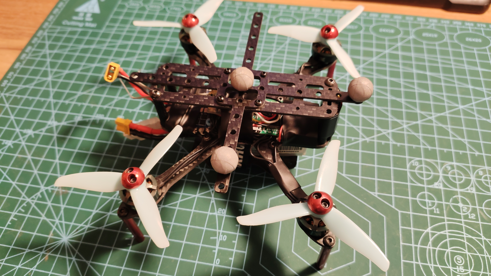

# GLDRONE

## 简介

GLDrone是独立自制机架和电调飞控的开源项目，轴距在140左右的小机型，为室内飞行与室内编队实验而研发。

## 图片及演示视频

  
  
   
<iframe height="480" width="100%" src="//player.bilibili.com/player.html?aid=891320934&bvid=BV1EP4y1L723&cid=432987595&page=1" scrolling="no" border="0" frameborder="no" framespacing="0" allowfullscreen="true"> </iframe>  
   
<iframe height="480" width="100%" src="//player.bilibili.com/player.html?aid=378817502&bvid=BV1vf4y1M7S2&cid=430310862&page=1" scrolling="no" border="0" frameborder="no" framespacing="0" allowfullscreen="true"> </iframe>  