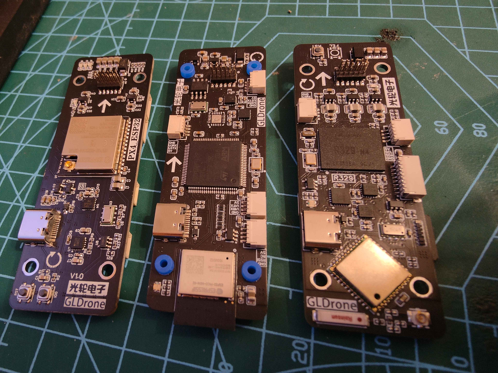
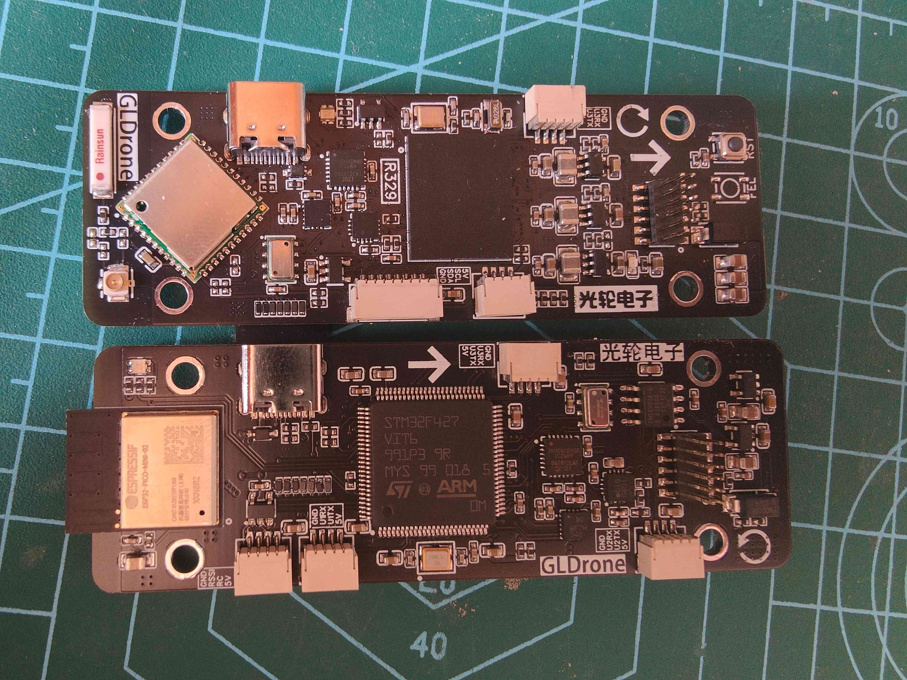

# 光轮电子飞行器项目汇总  
* 由于大飞机调试不方便，所以下面的机架及飞控设计都是对提及要求比较苛刻，尽量的将飞行器做的小型化。  

!!! note
    GLPX4-ESP32当前并未成功将PX4移植至ESP32,移植遇到诸多困难，仍在努力中。

### GLDrone飞行器
* [开源四旋翼飞行器GLDrone](gldrone.md#gldrone)
### 飞控

| 命名 | 方案 |
|:-----:|:-----:|
| GLPX4-F4 | 基于STM32F427VIT6 |
| GLPX4-H7 | 基于STM32H743VIH6 |
| GLPX4-R329 | 基于全志R329 |
| GLPX4-ESP32 | 基于ESP32 |
| GLDRONE-ESP32 | 基于ESP32 |

* [GLPX4-F4](glpx4-f4.md)
* [GLPX4-H7](glpx4-h7.md)
* [GLPX4-R329](glpx4-r329.md)
* [GLPX4-ESP32](glpx4-esp32.md)
* [GLDRONE-ESP32](gldrone-esp32.md)

  
!!! note
    从左到右: PX4-ESP32 PX4-F4 PX4-R329

  
!!! note
    从上到下: PX4-R329 PX4-F4  
    