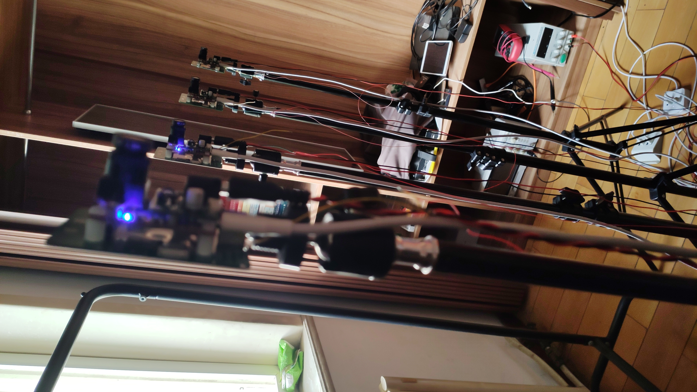

# 光轮电子的开源小站
* 本站所有项目皆为开源项目
* 软件全部开源
* 硬件原理图全部开源，PCB选择性开源
   
## 项目列表
### 已完成
* [吃鸡开发板(ATouch)](atouch/index.md#atouch)
* [OPENVIO](openvio/index.md#openvio)
* [CXK开发板](cxk/index.md#cxk)
* [CodeNotes插件(Vscode)](codenotes/index.md#codenotes)
* [其他小项目](openmvs3/index.md#openmvs3)
### 正在完善
* [运动捕捉系统GLMocap](mocap/index.md#mocap)
* [PX4硬件方案](px4/index.md#px4)
### 筹划中
* 智能语音音响
* 桌面机器人

## 说明文档
* [ATouch使用说明](atouch/guide.md#atouch)
  
## 链接

* [博客(old)](https://www.cnblogs.com/guanglun)
* [博客(new)](http://www.guanglundz.com:8086)
* [B站](https://space.bilibili.com/20909602)
* [淘宝](https://shop130446973.taobao.com/)
* [光轮电子交流群(群号:558343678)](https://jq.qq.com/?_wv=1027&k=5YPH1CV)

## 技术笔记

* [矩阵](math/matrix.md#matrix)
* [数学符号](math/symbol.md#symbol)

## 关于我

* [关于我](about/about.md#about)

## 项目图册

#### GLMocap开源项目
  
  
   

#### ATouch开源项目
    

#### OPENVIO开源项目
   

## END
