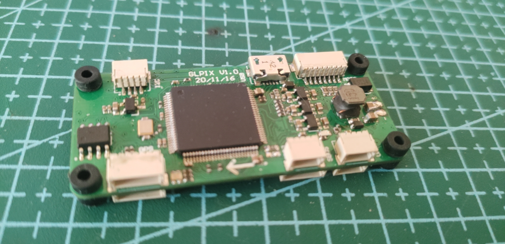
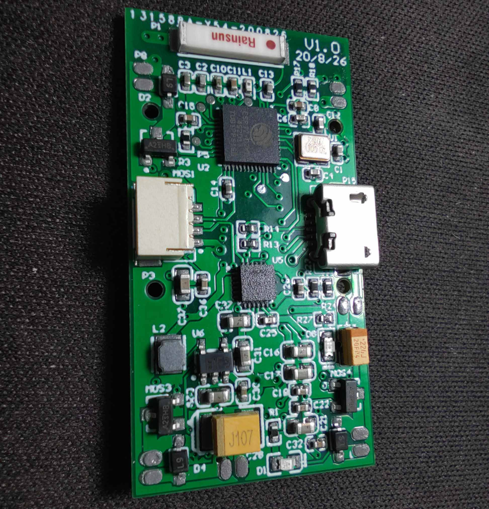
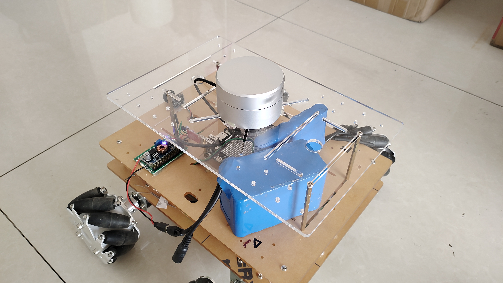

# 光轮电子的技术小站
   
   
## 产品列表

* [吃鸡开发板(ATouch)](atouch/index.md#atouch)
* [OPENVIO](openvio/index.md#openvio)
* [CXK开发板](cxk/index.md#cxk)

## 说明文档
* [ATouch使用说明](atouch/guide.md#atouch)

## 技术笔记

* [矩阵](math/matrix.md#matrix)
* [数学符号](math/symbol.md#symbol)
  
## 链接

* [博客](https://www.cnblogs.com/guanglun)
* [B站](https://space.bilibili.com/20909602)
* [淘宝](https://shop130446973.taobao.com/)
* [光轮电子交流群(群号:558343678)](https://jq.qq.com/?_wv=1027&k=5YPH1CV)

## 项目图册

#### ATouch开源项目
  

  

  

#### OPENVIO开源项目
  

  

  

  

#### 飞控
  

  

 

  

  

  

#### SLAM

  