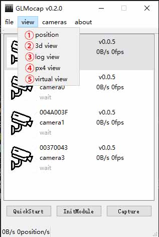
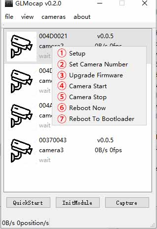
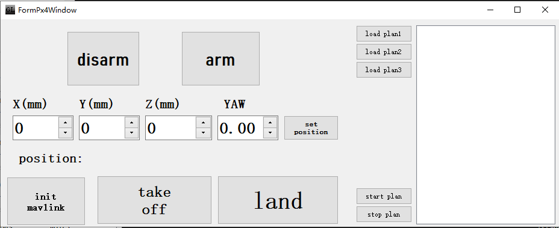
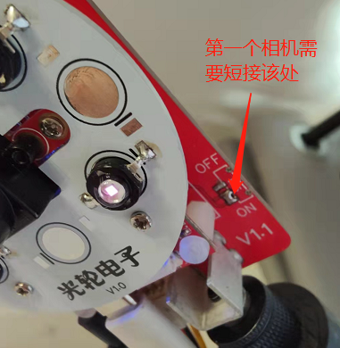
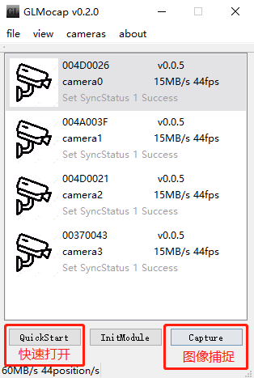
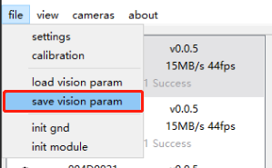
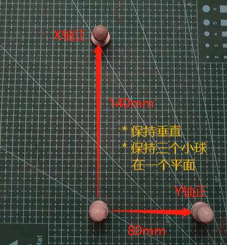
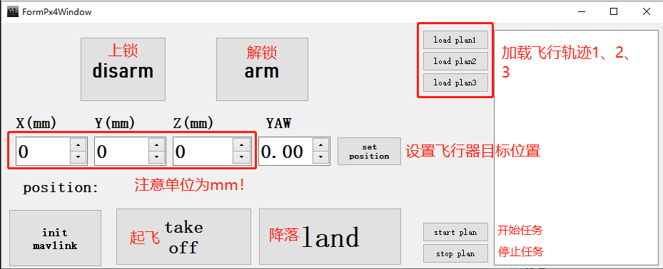

# 运动捕捉系统GLMocap使用说明

!!! warning
     ！！！郑重提醒  本套件不提供售后支持！源码都已100%开源请自行查阅！  
       
     本来项目还在研发阶段没计划做套件出售的，但是不少朋友表示只想测试现在已有的功能效果，故在项目和功能还很鸡肋的情况下开始售卖。特此说明，请仔细阅读一下功能限制、区别于市面商用视觉捕捉系统的诸多不足。目前项目还在初步研发阶段，如果你在犹豫是否购买，我的建议是不要购买！  
     如下为当前的不足：  
       
     视觉区域过小，仅支持4相机定位  
       
     红外反光球每次使用需要初始化，且必须同时出现在四个相机视野内，且不能运动过快，且不能遮挡或者两个反光球重合  
       
     标定需要使用棋盘标定，四相机需要放置到同一侧  

     诸多未知BUG

!!! warning
    本使用说明目前仅支持4相机套件，同时由于精力有限诸多功能和隐患无法顾及，敬请见谅。

## 四相机套件使用教程

!!! note
    不同版本套件使用会有所出入，教程会尽量顾及不同版本差异。

### 概览说明 
 
  

| 序号 | 说明 | 套件是否包含(不含则需自备) |
|:-----:|:-----|:-----:|
| ① | 相机1(软件设置中为相机0) | 是 |
| ② | 相机2(软件设置中为相机1) | 是 |
| ③ | 相机3(软件设置中为相机2) | 是 |
| ④ | 相机4(软件设置中为相机3) | 是 |
| ⑤ | 相机架(x4) | 否 |
| ⑥ | 3长Typec USB2.0数据线(x4)| 否 |
| ⑦ | 同步电源线(x4) | 是 |
| ⑧ | USB HUB | 否 |
| ⑨ | USB HUB | 否 |
| ⑩ | 同步电源板 | 是 |

### 相机接口说明 
 
  
  
| 序号 | 说明 | 套件是否包含(不含则需自备) |
|:-----:|:-----|:-----:|
| ① | M4固定座 | 是 |
| ② | 转接头，M4公转1/4母 | 否 |
| ③ | Typec USB接口 | 是 |
| ④ | XH2.54 3P同步电源接口 | 是 |

### 同步电源板接口说明 
 
  
  
| 序号 | 说明 | 套件是否包含(不含则需自备) |
|:-----:|:-----|:-----:|
| ① | XH2.54 3P同步电源接口(不分循序) | 是 |
| ② | 12V 1.5A直流电源输入接口(插头5.5mm) | 是 |

### GLMocap软件界面说明 
#### 主界面
 
  
  
| 序号 | 名称 | 说明 |
|:-----:|:-----|:-----|
| ① | 菜单栏 | 文件，窗口，相机，关于 |
| ② | 相机ID | 短ID，用于区分设备 |
| ③ | 相机固件版本 | 固件版本 |
| ④ | 相机序号 | 从camera0开始排序，目前只支持四相机，所以序号为0-3 |
| ⑤ | 相机实时传输速度 | 单相机USB传输速度、图像帧率 |
| ⑥ | 相机状态 | 显示每个相机的状态 |
| ⑦ | 快速开始 | 用于快速打开四个相机窗口，并启动数据传输 |
| ⑧ | 初始化模型 | 用于快速重新识别绑定用于无人机的三个红外marks |
| ⑨ | 图像捕捉 | 捕捉四个摄像头的图像，每0.5s捕捉一次，用于摄像头标定和图像分析 |
| ⑩ | 全部相机的实时传输速度 | 全部相机USB传输速度、定位速度 |

#### 菜单栏-文件（file）
 
  
  
| 序号 | 名称 | 说明 |
|:-----:|:-----|:-----|
| ① | 位置窗口 | 显示无人机定位的位置和姿态（单位mm） |
| ② | 3D窗口 | 模拟现实3D空间中摄像头及红外marks位置 |
| ③ | 日志窗口 | 显示程序运行日志 |
| ④ | PX4飞控控制窗口 | 进行PX4飞控控制 |
| ⑤ | 虚拟设备窗口 | 离线测试运行及识别验算算法时使用 |

#### 菜单栏-窗口（view）
 
  
  
| 序号 | 名称 | 说明 |
|:-----:|:-----|:-----|
| ① | 设置 | 设置相机数量，图像阈值，图像存储路径等 |
| ② | 标定 | 标定摄像头 |
| ③ | 加载视觉参数文件 | 加载视觉参数文件，ini后缀，默认文件名为vision.ini |
| ④ | 存储当前视觉参数到文件 | 存储当前视觉的参数到文件，ini后缀，默认文件名为vision.ini |
| ⑤ | 初始化大地 | 使用大地标定板标定"地" |
| ⑥ | 初始化模型 | 初始化识别模型 |

#### 菜单栏-相机（cameras）
 
  
  
| 序号 | 名称 | 说明 |
|:-----:|:-----|:-----|
| ① | 全部相机设置 | 一键打开全部相机设置界面 |
| ② | 全部相机升级 | 一键打开全部相机升级界面 |
| ③ | 全部相机开始传输图像 | 一键打开全部相机开始传输图像界面 |
| ④ | 全部相机停止传输图像 | 一键打开全部相机停止传输图像界面 |
| ⑤ | 打开全部相机窗口 | 一键打开全部相机窗口 |

#### 相机右击菜单
 
  
  
| 序号 | 名称 | 说明 |
|:-----:|:-----|:-----|
| ① | 相机设置 | 打开全部相机设置界面 |
| ② | 设置相机序号 | 从0号开始 |
| ③ | 升级相机固件 | 选择固件开始升级 |
| ④ | 开始相机传输 | 开始相机图像传输 |
| ⑤ | 停止相机传输 | 停止相机图像传输 |
| ⑥ | 重启相机 | 相机重启 |
| ⑦ | 重启相机至bootloader | 重启相机至bootloader |

#### 其他界面
* 相机图像界面  
 

* 软件配置界面  
 
 
* 标定界面  
 

* 定位姿态界面  
 

* 3D界面  
 

* Log界面  
 

* PX4控制界面  
 

* 虚拟界面  
 

* 相机配置界面  
 

### 使用说明
#### 1.安装
* 请移步下载最新GLMocap软件 [https://github.com/guanglun/GLMocap/releases](https://github.com/guanglun/GLMocap/releases)，首次使用请下载包含库的打包文件。

!!! warning
    请务必将软件运行在中文路径下！

* 请按照上图所示进行四相机的安装及固定，四个相机中的其中一个（仅一个，且一般是第一个编号为0的相机）需要短接同步接口。  
 
* 由于尚在测试开发阶段，所以首先请使用较小的公共视野范围进行测试，推荐按照上图所示的空间进行测试，大概2x2x2m空间。
* USB2.0数据线使用质量好一些的线，为了保证USB接口数据吞吐量足够，请合理分配USB接口。  

!!! warning
    请按照四相机推荐位置摆放相机，使其同向且有公共视野。

!!! warning
    如果四个USB都插到一个HUB上进行图像传输可能会数据量过大导致无法使用！  

* 运行GLMocap的电脑请使用性能高些的电脑。

#### 2.设置相机序号
推荐序号顺序如下：
  

* USB数据线全部断开，插入第一个摄像头（上图最左面），软件主界面会出现一个摄像头，右击设置相机序号为0，设置完毕后相机会出现camera0的说明字样。  
  
* 拔出设置好的第一个摄像头，插入第二个摄像头（左数第二个），主界面软件主界面会出现一个摄像头，右击设置相机序号为1，设置完毕后相机会出现camera1的说明字样。  
* 后面2个摄像头以此类推，就会将四个摄像头序号设置完毕。 
  
  

#### 3.校准
* 点击主界面左下角的`QuickStart`快速打开四个摄像头。  
  
* 相机工作正常情况下如下所示： 
 
* 拿出准备好的校准棋盘(A4纸打印，[棋盘文件](../file/calib.io_checker_297x210_7x10_25.pdf))，放在四个摄像头公共视野下面。
* 点击主界面右下角`Capture`按键，开始捕捉。捕捉开始后默认会在可执行文件目录创建以时间命名的文件夹用来保存四个摄像头捕捉的画面，比如 `2022-03-06-13-27-37-678`。  
* 在各个方向（保证四个摄像头都能看到）移动棋盘，待捕捉充分后点击右下角`Capture`（已经变成了`stop`）按键，结束捕捉。  
  
* 打开`calibration`（标定）界面，选择刚刚捕捉的图片文件夹`2022-03-06-13-27-37-678`，然后点击下面的`Calibration`按键开始标定摄像头。
* 标定完成后会打印误差数据，可以查阅参考。 
 
* 此时需要将标定完的数据保存到文件，默认文件在可执行文件的所属文件夹下，名称为vision.ini。  
 
* 保存校准文件以后，需要校准地面。使用三个红外mark制作地面标定板并放置在地面。
  
* 点击地面校准按键。  
  

!!! warning
    务必确保四个相机的视野内只有标定板上的3个红外marks，否则误识别会曹成无法标定。如果光线问题请调试相机阈值

!!! note
    点击相机图像界面的vision界面可以切换显示效果  
      
 
* 校准地面完毕后可以打开3D界面看到摄像头的排布：    
  
* 到这里校准完成。  

#### 4.追踪模型

* 制作红外marks模型  
 
* 将模型放置到公共视野内，点击主界面下面的`InitModule`按钮识别追踪模型（飞行器）。 
  

!!! warning
    务必确保四个相机的视野内只有模型上的3个红外marks，否则误识别会曹成无法标定。

* 此时移动模型（在公共视野内）可以看到3D界面中3个mark在伴随移动。 
 

#### 5.飞行器控制  

* 给飞行器上电，电脑连接WIFI:`DroneBridge ESP32`，密码:`dronebridge`. 
* 将飞行器放置于坐标零点（方向对准正前方），按照`4.追踪模型`的说明校准模型，成功后3D界面显示如下：  
  
* 打开PX4上位机`QGC`,通过WIFI连接上无人机后将无人机飞行模式改为`Offboard`模式  
  
* `QGC`上位机显示`Ready To Fly`以后，打开PX4控制界面，此时可以准备飞行.  

!!! warning
    解锁飞行前请务必确保视觉定位系统工作正常！务必确保飞行器四轴空间没有遮挡物和障碍物！ 

* 先点击`arm`解锁飞行器，此时飞行器螺旋桨会转起来但不会起飞.再点击`disarm`将对飞行器上锁关闭电机.  
  

!!! warning
    请随时准备着在飞行器飞行出现错误或者不受控制后点击`disarm`,这将直接关闭电机避免伤人！ 

* 以上解锁、上锁操作无误后，点击`arm`解锁飞行器，并点击`take off`控制飞行器起飞，此时飞行器将飞到[x:y:z]=[0,0,0.5]即半米高度.此时飞行器会在半米高度悬停。  
  
  
* `set position`可以设置飞行器悬停的目标位置  

!!! warning
    使用`set position`前请仔细检查目标位置设置是否合理，否则飞行器飞出任意一个摄像头视野飞行器就会失控！  

* `load plan`可以加载预先设计好的飞行路径（目前只支持在代码内设置飞行路径）.加载完毕后点击`start plan`开启轨迹飞行，`stop plan`停止轨迹飞行.  

!!! warning
    轨迹飞行会在较大范围内运动，请确保飞行器不会飞出任意摄像头的视野外！  

* `land`按键会将飞行的目标位置设置成[0,0,0]即坐标原点，这样就实现了降落.降落后点击`disarm` 即可使飞行器上锁.

!!! note
    飞行器在低电量状态下会自动降落.  

