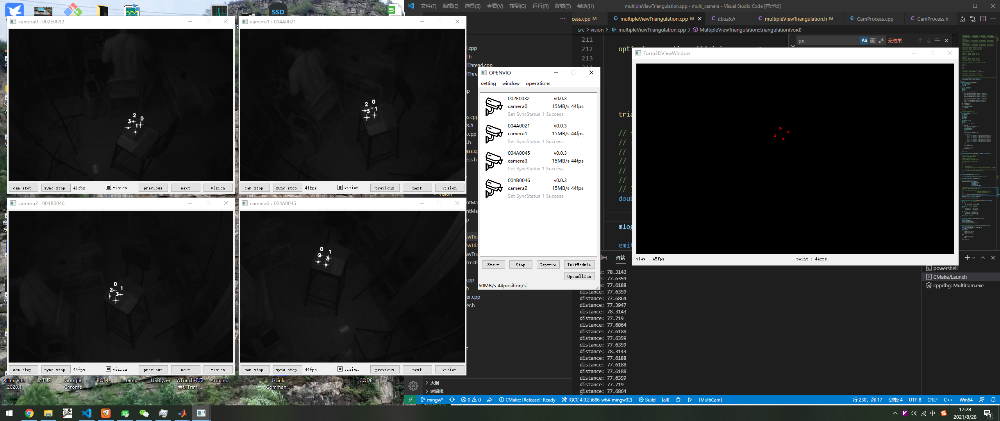
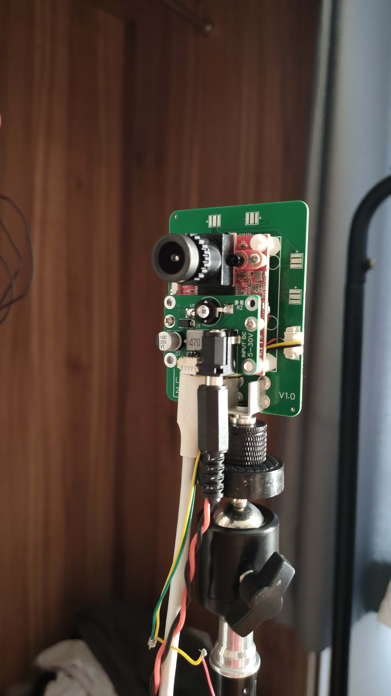

# 运动捕捉系统GLMocap

## 简介

运动捕捉系统GLMocap包括多相机硬件开源方案和上位机软件算法方案的低成本运动捕捉系统。目前设计指标为低成本实现毫米级空间定位。  

## 软硬件基本说明
* 上位机基于QT
* 硬件为OPENVIO加装红外装置

## 最终目标
* 毫米级室内定位
* 室内多机编队

## 硬件功能研发进度
| 功能 | 进度 |
|:-----:|:-----:|
| 摄像头捕捉 | 已完成 |
| 时间戳同步 | 已完成(100ns同步)|
| USB设备开发 | 已完成 |
| 850nm红外光源 | 已完成 |
| 新版基于以太网的更高帧率摄像头硬件 | 还未开启 |  

## 上位机功能研发进度
| 功能 | 进度 |
|:-----:|:-----:|
| USB设备 | 已完成 |
| 地面校准 | 研发完成 |
| 视觉处理 |已完成|
| 多摄像头定位 |已完成|
| 标记跟踪 |已完成|
| 3D窗口 |已完成|
| PX4飞行器定位导航 | 正在研发 |
| 多机定位规划 | 正在研发 |

## 硬件参数  
* MCU : STM32H743VIT6  
* sensor : MT9V034(目前在45fps帧率下捕捉)  
* USB2.0  
* 850nm红外光源  

## 关于图像捕捉同步
目前方案基于USB传输图像至PC做处理，根相机节点负责产生指定周期的采样触发信号给各个相机节点，相机在捕获到上升沿或下降沿后去触发感光芯片的capture功能，根据示波器测得的捕获到同一帧数据的延迟在100ns以内。  

根节点-------------------------------------(45hz触发信号)  
&#8195;&#8195;&#8195;&#8195;|&#8195;&#8195;&#8195;&#8195;|&#8195;&#8195;&#8195;&#8195;|&#8195;&#8195;&#8195;&#8195;|  
&#8195;&#8195;&#8195;&#8195;|&#8195;&#8195;&#8195;&#8195;|&#8195;&#8195;&#8195;&#8195;|&#8195;&#8195;&#8195;&#8195;|  
&#8195;&#8195;根节点&#8195;子节点&#8195;子节点&#8195;子节点  

## 图片及演示视频
<iframe height="480" width="100%" src="//player.bilibili.com/player.html?aid=932869945&bvid=BV1WM4y1G7vQ&cid=403535074&page=1" scrolling="no" border="0" frameborder="no" framespacing="0" allowfullscreen="true"> </iframe>
   
  
<br />  
  
   
  
   
  
   
<iframe height="480" width="100%" src="//player.bilibili.com/player.html?aid=462396065&bvid=BV16L411J7ir&cid=391316899&page=1" scrolling="no" border="0" frameborder="no" framespacing="0" allowfullscreen="true"> </iframe>

