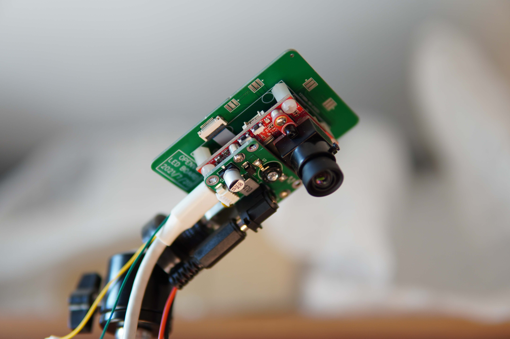

# 运动捕捉系统GLMocap

## 简介

运动捕捉系统GLMocap包括多相机硬件开源方案和上位机软件算法方案的低成本运动捕捉系统。目前设计指标为低成本实现毫米级空间定位，辅助无人机等有室内定位需求的装置和设备。  

* [GLMocap使用说明](guide.md#mocap)

## 源码和资料
[github](https://github.com/guanglun/GLMocap)  
[gitee](https://gitee.com/guanglunking/GLMocap)  
[OPENVIO摄像头](../openvio/index.md#openvio)  
[淘宝店铺](https://item.taobao.com/item.htm?id=669962150347)  

## 软硬件基本说明
* 上位机基于QT5，C++编程
* 硬件为加装红外装置的[OPENVIO摄像头](../openvio/index.md#openvio)

## 软件编译环境说明
* 目前仅支持windows下编译使用，linux环境未经测试
* 使用Qt5.12.11,mingw730_64编译
* cmake版本为3.21.1
* eigen-3.2.10
* libusb-1.0
* opencv 4.5.3
* assimp 4.0.1
* release提供的编译好的exe和库皆为64位版本  
* 使用vscode下的cmake tools插件可轻松编译

## 最终目标
* 毫米级室内定位
* 室内多机编队

## 硬件功能研发进度
| 功能 | 进度 |
|:-----:|:-----:|
| 摄像头捕捉 | 已完成 |
| 时间戳同步 | 已完成(100ns同步)|
| USB设备开发 | 已完成 |
| 850nm红外光源 | 已完成 |
| 新版基于以太网的更高帧率摄像头硬件 | 还未开启 |  

## 上位机功能研发进度
| 功能 | 进度 |
|:-----:|:-----:|
| USB设备 | 已完成 |
| 地面校准 | 已完成 |
| 视觉处理 |已完成|
| 多摄像头定位 |已完成|
| 标记跟踪 |已完成|
| 3D窗口 |已完成|
| 多摄像头标定 | 已完成 |
| 单机定位规划 | 已完成 |
| PX4飞行器定位导航 | 正在研发 |
| 多机定位规划 | 正在研发 |

## 硬件参数  
* MCU : STM32H743VIT6  
* sensor : MT9V034(目前在45fps帧率下捕捉)  
* USB2.0  
* 850nm红外光源  

## 关于图像捕捉同步
目前方案基于USB传输图像至PC做处理，根相机节点负责产生指定周期的采样触发信号给各个相机节点，相机在捕获到上升沿或下降沿后去触发感光芯片的capture功能，根据示波器测得的捕获到同一帧数据的延迟在100ns以内。  

根节点-------------------------------------(45hz触发信号)  
&#8195;&#8195;&#8195;&#8195;|&#8195;&#8195;&#8195;&#8195;|&#8195;&#8195;&#8195;&#8195;|&#8195;&#8195;&#8195;&#8195;|  
&#8195;&#8195;&#8195;&#8195;|&#8195;&#8195;&#8195;&#8195;|&#8195;&#8195;&#8195;&#8195;|&#8195;&#8195;&#8195;&#8195;|  
&#8195;&#8195;根节点&#8195;子节点&#8195;子节点&#8195;子节点  

## 当前存在问题及待实现功能
* 摄像头标定使用opencv的话对比matlab精度较低，速度也非常的慢
* 目前标定使用棋盘标定，没有mark点标定灵活好用
* 定位未加滤波
* 定位点初始化后一旦丢失或者重合，数据点将永远丢失或者错乱，此处程序需要优化
* 摄像头本身分辨率和帧率限制

## 感谢
[https://github.com/gwjensen/SnakeStrike](https://github.com/gwjensen/SnakeStrike)  

## 图片及演示视频
   
 
   
<iframe height="480" width="100%" src="//player.bilibili.com/player.html?aid=719184650&bvid=BV1cQ4y1U7HJ&cid=442156475&page=1" scrolling="no" border="0" frameborder="no" framespacing="0" allowfullscreen="true"> </iframe>  
  
<iframe height="480" width="100%" src="//player.bilibili.com/player.html?aid=505922419&bvid=BV1eg411F7gY&cid=420999050&page=1" scrolling="no" border="0" frameborder="no" framespacing="0" allowfullscreen="true"> </iframe>  
  
<iframe height="480" width="100%" src="//player.bilibili.com/player.html?aid=975472490&bvid=BV1f44y1t7sN&cid=408341305&page=1" scrolling="no" border="0" frameborder="no" framespacing="0" allowfullscreen="true"> </iframe>  
   
<iframe height="480" width="100%" src="//player.bilibili.com/player.html?aid=932869945&bvid=BV1WM4y1G7vQ&cid=403535074&page=1" scrolling="no" border="0" frameborder="no" framespacing="0" allowfullscreen="true"> </iframe>
   
<iframe height="480" width="100%" src="//player.bilibili.com/player.html?aid=462396065&bvid=BV16L411J7ir&cid=391316899&page=1" scrolling="no" border="0" frameborder="no" framespacing="0" allowfullscreen="true"> </iframe>
   
 
   
  
   
  
   
  

