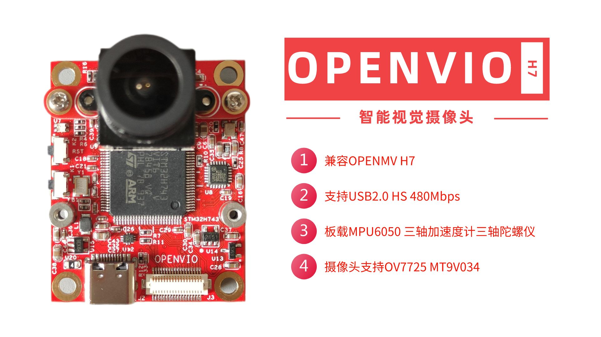
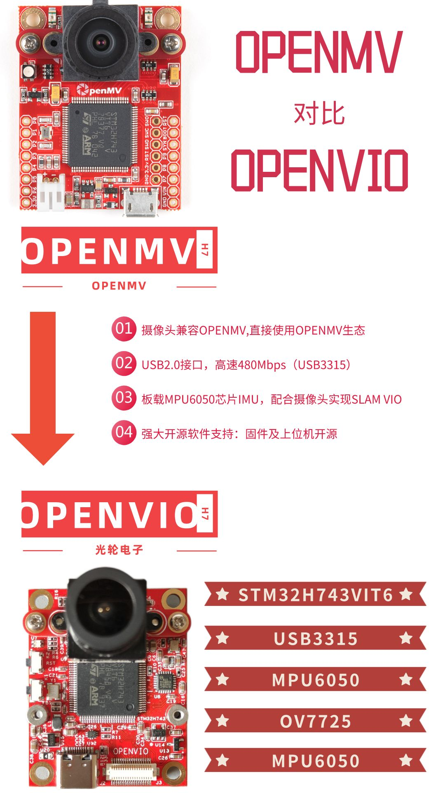
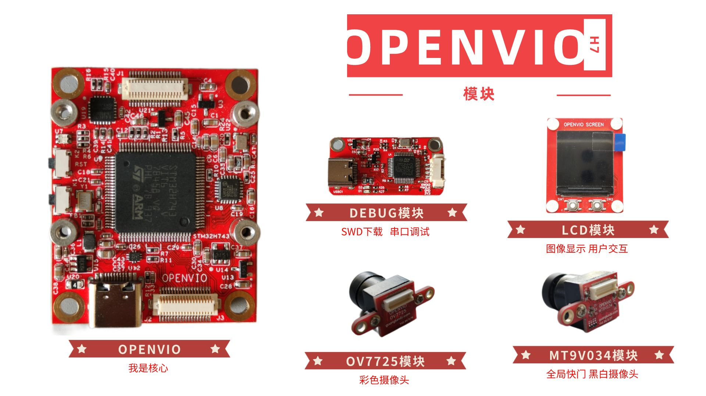
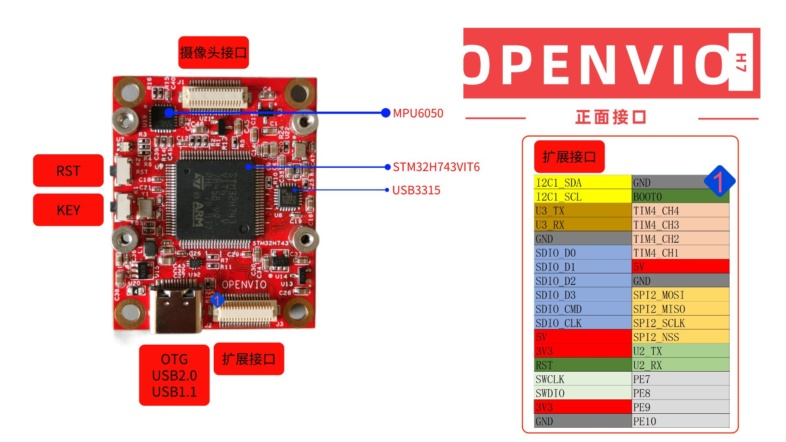
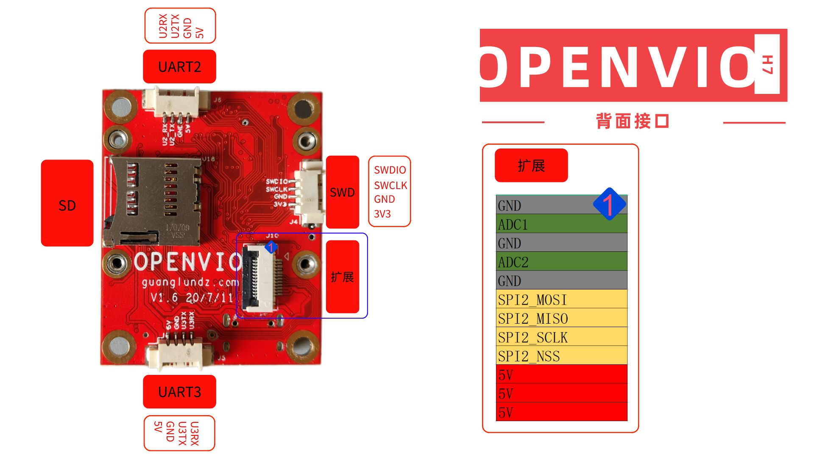
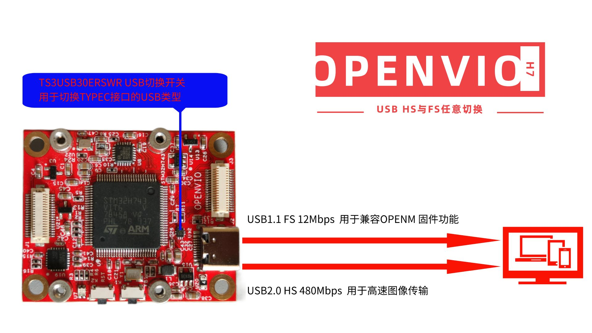
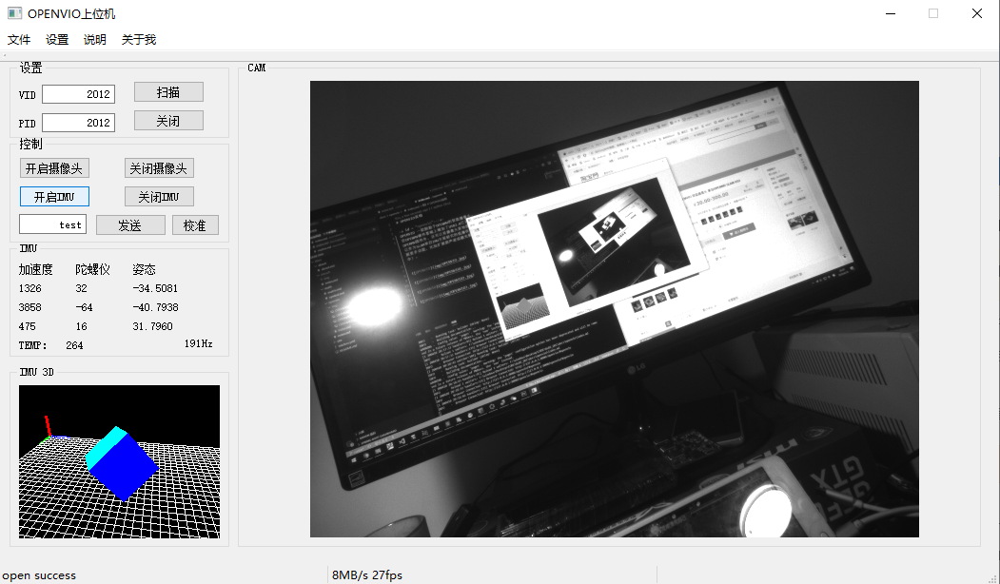
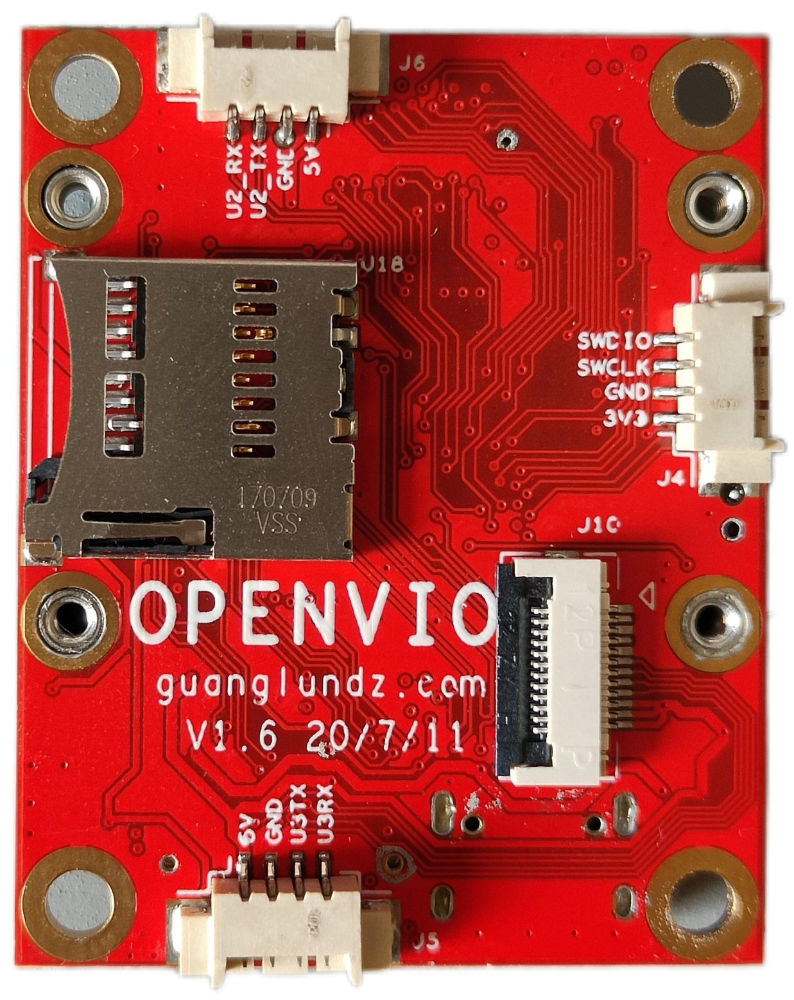

# OPENVIO使用说明

## 简介

  

OPENVIO 一款脱胎于OPENMV的智能摄像头。

在OPENMV硬件基础上增加了USB2.0芯片(USB3315)和IMU芯片(MPU6050),除却兼容OPENMV固件外,还可以将摄像头原始图像(未压缩图像)和IMU九轴数据高速传输至PC,可以作为SLAM单目IMU方案研究的低廉传感器方案(如港科大的VINS-MONO)。  
OPENVIO摄像头用在[GLMocap](https://guanglundz.com/mocap)项目上实现了多目视觉运动捕捉功能。 
多种接口方便扩展更多功能，比如扩展超声波或激光模块后作为PX4光流模块使用(暂未实现 还在研发中)。  

## 源码和资料

#### 基础源码(OV7725 MT9V034 MPU6050 LCD USB)  

[OPENVIO源码(github)](https://github.com/guanglun/openvio_board)【开发环境：Keil5】  

[OPENVIO PC上位机(github)](https://github.com/guanglun/openvio_pc)【开发环境：QT5.6.0 qt-opensource-windows-x86-mingw492-5.6.0】  

[OPENVIO ROS源码(github)](https://github.com/guanglun/openvio_ros)

#### 新架构OPENVIO源码用于GLMocap视觉动捕项目  

[新架构OPENVIO 上位机源码(github)](https://github.com/guanglun/GLMocap)【详情查阅[GLMocap](https://guanglundz.com/mocap)项目】  

[新架构OPENVIO-APP源码(github)](https://github.com/guanglun/openvio)【开发环境：Vscode Makefile】  

[新架构OPENVIO-BOOTLOADER源码(github)](https://github.com/guanglun/openvio_bootloader)【开发环境：Vscode Makefile】 

[新架构OPENVIO-APP源码(gitee)](https://gitee.com/guanglunking/openvio)【开发环境：Vscode Makefile】  

[新架构OPENVIO-BOOTLOADER源码(gitee)](https://gitee.com/guanglunking/openvio_bootloader)【开发环境：Vscode Makefile】  

#### OPENVIO原理图  
[OPENVIO V1.6版本硬件原理图(github)](https://github.com/guanglun/openvio_board/blob/master/Doc/OPENVIO_V1.6_SCH.pdf)

#### 购买访问  
[淘宝店铺](https://item.taobao.com/item.htm?id=615919130291)  

## 与OPENMV固件兼容性说明
可以直接刷入OPENMV H7的官方固件使用，也就是说，摄像头的功能皆兼容。但是由于扩展接口不同，所以不对官方固件做兼容。  

| 三色LED | OV7725 | MT9V034 | 其他模块 |
|:-----:|:-----:|:-----:|:-----:|
| 仅兼容一颗 | 兼容 | 兼容 | 不兼容 |  

 
 

## 功能及研发进度
| 功能 | 进度 |
|:-----:|:-----:|
| OPENMV两款摄像头兼容 | 已完成 |
| SLAM VIO 单目IMU传感器功能 | 已完成 |
| 港科大VINS-MONO | 已完成 |
| PC上位机 | 已完成 |
| 小Demo | 已完成 |
| PX4光流 | 正在研发 |

 

## 已有模块及正在研发模块

| 模块 | 进度 |
|:-----:|:-----:|
| OV7725 | 已完成 |
| MT9V034 | 已完成 |
| 下载调试器模块 | 已完成 |
| 正面彩屏模块 | 取消研发 |
| 背面彩屏模块 | 已完成 |
| 背面彩屏及锂电源模块 | 择机研发 |
| 超声波模块 | 取消研发 |  

  

## 接口
  
  

## USB HS FS 切换
  

### PC上位机(基础版本)

### VINS-Mono

## 图片

### OPENVIO V1.6 正面

  

### OPENVIO V1.6 背面
  