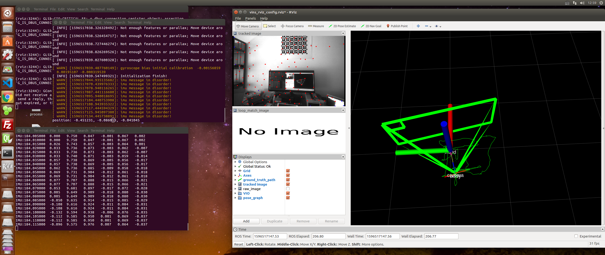
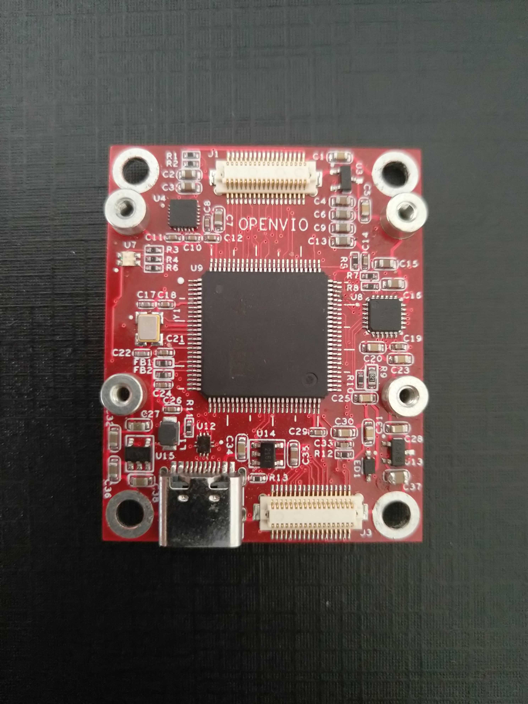

# OPENVIO使用说明

<a id = "openvio"></a>

## 简介

OPENVIO 一款脱胎于OPENMV的智能摄像头。

在OPENMV硬件基础上增加了USB2.0芯片(USB3315）和IMU芯片（MPU6050），除却兼容OPENMV固件外，还可以将摄像头原始图像（未压缩图像）和IMU九轴数据高速传输至PC，可以作为SLAM单目IMU方案研究的低廉传感器方案（如港科大的VINS-MONO）.多种接口方便扩展更多功能，比如扩展超声波或激光模块后作为PX4光流模块使用（暂未实现 还在研发中）。

## 源码和资料

[OPENVIO源码](https://gitee.com/guanglunking/OPENVIO_BOARD)【开发环境：Keil5】  

[OPENVIO PC上位机](https://gitee.com/guanglunking/OPENVIO_PC)【开发环境：QT5.6.0 qt-opensource-windows-x86-mingw492-5.6.0】  

[OPENVIO ROS源码](https://gitee.com/guanglunking/OPENVIO_ROS)

[淘宝店铺](https://item.taobao.com/item.htm?id=615919130291)  

## 与OPENMV固件兼容性说明
可以直接刷入OPENMV H7的官方固件使用，也就是说，摄像头的功能皆兼容。但是由于扩展接口不同，所以不对官方固件做兼容。  

| 三色LED | OV7725 | MT9V034 | 其他模块 |
|:-----:|:-----:|:-----:|:-----:|
| 仅兼容一颗 | 兼容 | 兼容 | 不兼容 |  

</br>

## 功能及研发进度
| 功能 | 进度 |
|:-----:|:-----:|
| OPENMV两款摄像头兼容 | 已完成 |
| SLAM VIO 单目IMU传感器功能 | 已完成 |
| 港科大VINS-MONO | 已完成 |
| PC上位机 | 正在研发 |
| 小Demo | 正在研发 |
| PX4光流 | 正在研发 |

</br>

## 已有模块及正在研发模块

| 模块 | 进度 |
|:-----:|:-----:|
| OV7725 | 已完成 |
| MT9V034 | 已完成 |
| 下载调试器模块 | 已完成 |
| 正面彩屏模块 | 正在研发 |
| 背面彩屏及锂电源模块 | 正在研发 |
| 超声波模块 | 正在研发 |


## Vins-Mono 安装和使用

[VINS-MONO链接](https://github.com/HKUST-Aerial-Robotics/VINS-Mono)

* ubuntu16 
* ros版本kinetic



### ROS安装

* 设置Ubuntu的sources.list
```
sudo sh -c 'echo "deb http://packages.ros.org/ros/ubuntu $(lsb_release -sc) main" > /etc/apt/sources.list.d/ros-latest.list'
```

* 设置key
```
sudo apt-key adv --keyserver hkp://ha.pool.sks-keyservers.net:80 --recv-key C1CF6E31E6BADE8868B172B4F42ED6FBAB17C654
```

* 更新package
```
sudo apt-get update
```

* 安装ROS kinetic完整版
```
sudo apt-get install ros-kinetic-desktop-full
```

* 安装完可以查看可用的package
```
apt-cache search ros-kinetic
```

* 更新环境
```
echo "source /opt/ros/kinetic/setup.bash" >> ~/.bashrc
source /opt/ros/kinetic/setup.bash
```

* 创建工作空间
```
mkdir -p ~/catkin_ws/src
mkdir -p ~/catkin_ws/build
mkdir -p ~/catkin_ws/devel
```

### VINS-MONO安装编译

* 安装package
```
sudo apt-get install ros-kinetic-cv-bridge ros-kinetic-tf ros-kinetic-message-filters ros-kinetic-image-transport
```

#### 安装Ceres 
[Ceres安装链接](http://ceres-solver.org/installation.html)

* 编译准备
```
# CMake
sudo apt-get install cmake
# google-glog + gflags
sudo apt-get install libgoogle-glog-dev
# BLAS & LAPACK
sudo apt-get install libatlas-base-dev
# Eigen3
sudo apt-get install libeigen3-dev
# SuiteSparse and CXSparse (optional)
# - If you want to build Ceres as a *static* library (the default)
#   you can use the SuiteSparse package in the main Ubuntu package
#   repository:
sudo apt-get install libsuitesparse-dev
# - However, if you want to build Ceres as a *shared* library, you must
#   add the following PPA:
sudo add-apt-repository ppa:bzindovic/suitesparse-bugfix-1319687
sudo apt-get update
sudo apt-get install libsuitesparse-dev
```

* 编译安装
```
wget http://ceres-solver.org/ceres-solver-1.14.0.tar.gz
tar zxf ceres-solver-1.14.0.tar.gz
mkdir ceres-bin
cd ceres-bin
cmake ../
make -j4
make test
# Optionally install Ceres, it can also be exported using CMake which
# allows Ceres to be used without requiring installation, see the documentation
# for the EXPORT_BUILD_DIR option for more information.
make install
```

#### Eigen3.3.3 安装
* Eigen3.3.3 安装
```
wget https://codeload.github.com/eigenteam/eigen-git-mirror/tar.gz/3.3.3
mv 3.3.3 eigen-git-mirror-3.3.3.tar.gz
tar zxf eigen-git-mirror-3.3.3.tar.gz
cd eigen-git-mirror-3.3.3

mkdir build
cd build
cmake ..
make
make install

```

#### OpenCV-3.3.1 安装
* OpenCV-3.3.1 安装
```
wget https://codeload.github.com/opencv/opencv/tar.gz/3.3.1
mv 3.3.1 opencv-3.3.1.tar.gz
tar zxf opencv-3.3.1.tar.gz
cd opencv-3.3.1

mkdir build
cd build
cmake ..
make -j8
make install

```

* 编译
```
cd ~/catkin_ws/src
git clone https://github.com/HKUST-Aerial-Robotics/VINS-Mono.git
cd ../
catkin_make
source ~/catkin_ws/devel/setup.bash
```

### ROS_OPENVIO 编译
* ROS_OPENVIO 编译流程
```
cd ~/catkin_ws/src
git clone https://gitee.com/guanglunking/OPENVIO_ROS
cd ../
catkin_make
source ~/catkin_ws/devel/setup.bash
```

### 执行
* 在三个终端中分别执行如下命令（如果单独执行rosrun openvio openvio_ros失败的话则需要先在一个新窗口中roscore）
```
roslaunch vins_estimator euroc.launch
roslaunch vins_estimator vins_rviz.launch
rosrun openvio openvio_ros
```

### ROS常用命令

* roscore 是你在运行所有ROS程序前首先要运行的命令
```
roscore
```

* 列出正在运行的节点
```
rosnode list
```

* 查看某个特定节点信息
```
rosnode info [node_name]
```

* 列出所有的topic
```
rostopic list -v
```

* 显示topics上发布的message
```
rostopic echo [topic_name]
```

* 查看topic的message类型
```
rostopic type [topic_name]
```

* 查看message数据结构
```
rosmsg show [message_name]
```


## 图片

### V1.0版本


### V1.2版本


### V1.3版本





### V1.4版本


### V1.5版本


### V1.6版本


### PC上位机


### VINS-Mono


