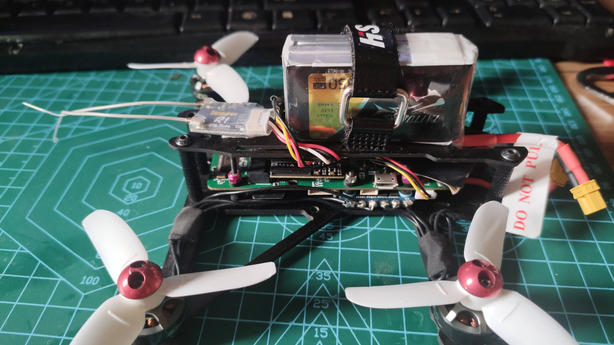
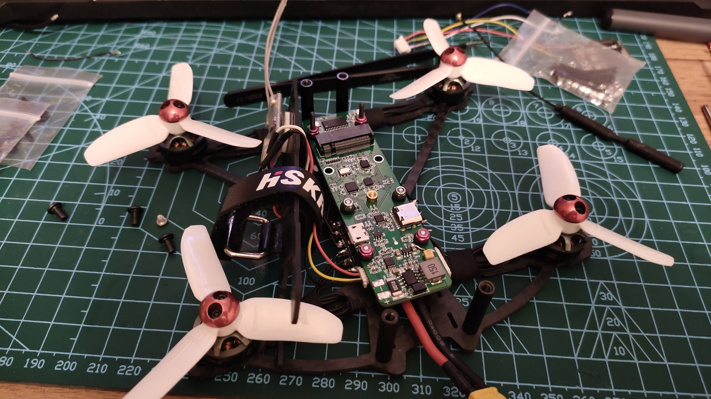
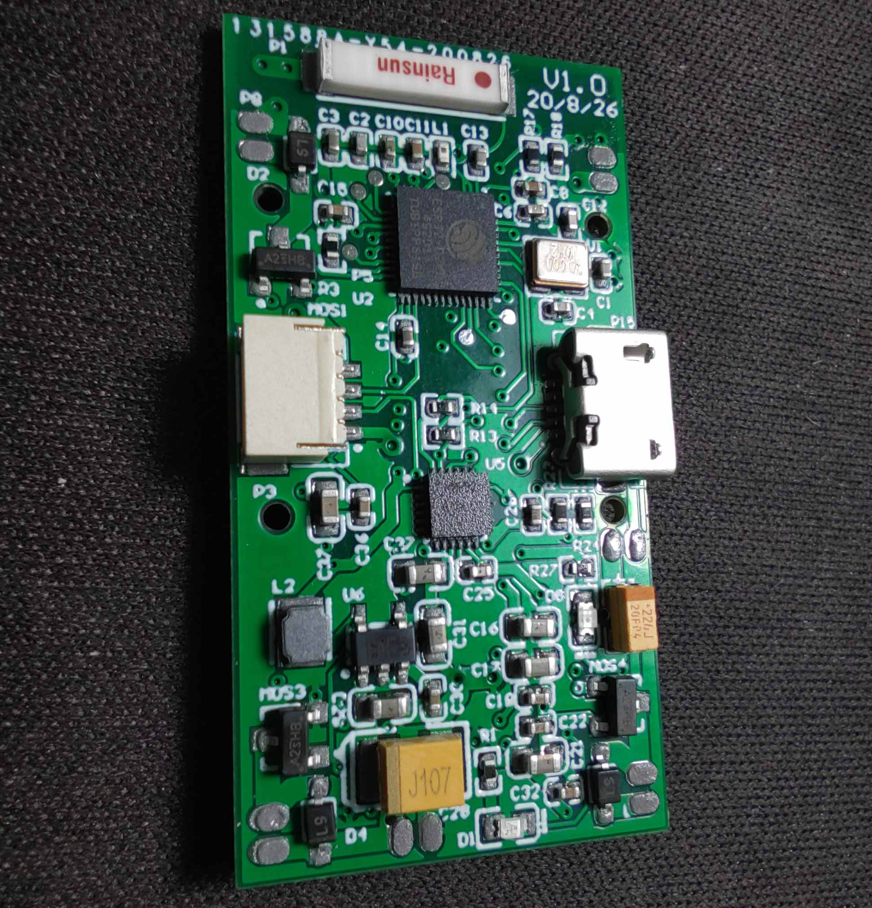

# PX4硬件方案

<a id = "px4"></a>

## 简介

基于px4做的几款飞控硬件方案

## 硬件方案 

| 命名 | 方案 |
|:-----:|:-----:|
| GLPX4-F4 | 基于STM32F427VIT6 |
| GLPX4-H7 | 基于STM32H743VIH6 |
| GLPX4-R329 | 基于全志R329 |
| GLPX4-ESP32 | 基于ESP32 |

### GLPX4-F4 
* 主控: STM32F427VIT6
* IMU： MPU9250 ICM-20602
* 磁力计：LIS3MDL
* 气压计：MS5611
* 光流：PMW3901MB
* 激光：VL53L1X

### GLPX4-H7
* 主控：STM32H743VIH6
* IMU：MPU9250 ICM-20602
* 磁力计：LIS3MDL
* 气压计：MS5611

### GLPX4-R329
* 主控：全志R329
* IMU: ICM-20689 ICM-20602
* 磁力计：IST8310
* 气压计：MS5611
* PWM: PCA9685PW

### GLPX4-ESP32
* 主控： ESP32-D2WD
* IMU： MPU9250
* 光流：PMW3901MB
* 激光：VL53L1X

## 图片及演示视频

### GLPX4-R329
<iframe height="480" width="100%" src="//player.bilibili.com/player.html?aid=847546378&bvid=BV1UL4y1a76o&cid=394305751&page=1" scrolling="no" border="0" frameborder="no" framespacing="0" allowfullscreen="true"> </iframe>  
<br />  

  
<br />  

  
<br />  

  
<br />  

  
<br />  

### GLPX4-F4
<iframe height="480" width="100%" src="//player.bilibili.com/player.html?aid=420006883&bvid=BV1d3411q7Dd&cid=394311072&page=1" scrolling="no" border="0" frameborder="no" framespacing="0" allowfullscreen="true"> </iframe>  
<br />  

  
<br />  

### GLPX4-H7
  
<br />  

### GLPX4-ESP32
<iframe height="480" width="100%" src="//player.bilibili.com/player.html?aid=420001535&bvid=BV1N3411B7ig&cid=394308441&page=1" scrolling="no" border="0" frameborder="no" framespacing="0" allowfullscreen="true"> </iframe>  
<br />  

  
<br />  

### GLPX4_R329开机自启动
脚本auto_run.sh
```
nohup taskset -c 1 /root/px4/build/px4_raspberrypi_default/bin/px4 -s /root/px4/px4.config -d &> 1 > /root/px4/px4.log
```
添加至/etc/rc.local

### armbian添加isolcpus
vim /boot/armbianEnv.txt
添加：
```
extraargs=isolcpus=1
```
